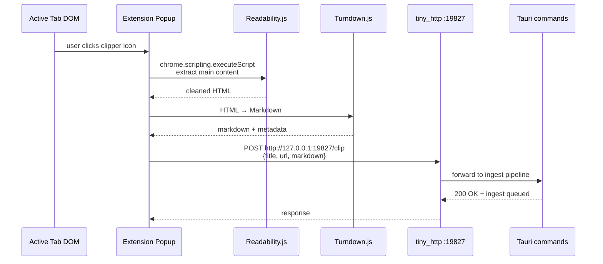
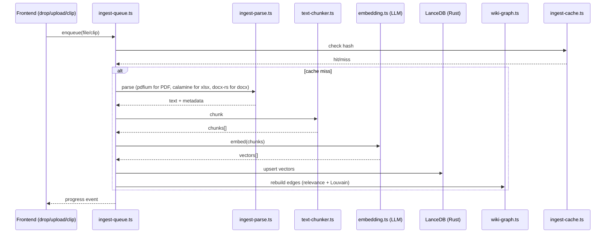
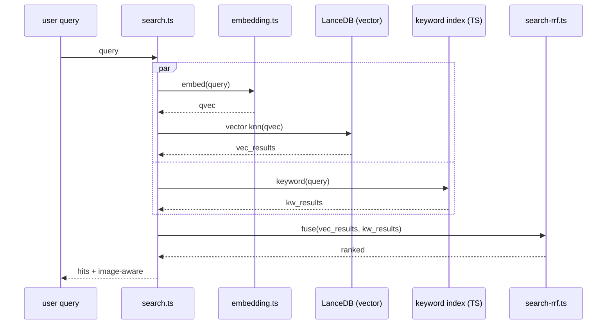

# 02 — System Architecture

> **Bar:** process boundaries / IPC topology / data flow / trust boundaries / concurrency 모델 — text + mermaid 만 사용해요.
> **Source pin:** `nashsu/llm_wiki@1434e08`

## Process Boundaries

```mermaid
flowchart LR
    subgraph Renderer["Renderer (WebView)"]
      App[React 19 App<br/>src/App.tsx]
      Stores[Zustand Stores<br/>src/stores/*-store.ts]
      Editor[Milkdown Editor]
      Graph[Sigma + Louvain]
    end

    subgraph TauriCore["Tauri Core (Rust process)"]
      Cmds["#[command]s<br/>src-tauri/src/commands/*.rs"]
      ClipSrv["clip_server.rs<br/>tiny_http :19827"]
      PanicG[panic_guard.rs]
      LanceDB[(LanceDB<br/>vector store)]
      PDFium[pdfium-render<br/>FFI → libpdfium]
      ClaudeCLI["tokio::process<br/>spawn `claude`"]
    end

    subgraph Extension["Chrome MV3 Extension"]
      Popup[popup.{html,js}]
      Reada[Readability.js<br/>vendored]
      Turn[Turndown.js<br/>vendored]
    end

    subgraph External["External services"]
      LLM["LLM Provider<br/>(OpenAI-compatible)"]
      Web[Web Search]
      Vision[Vision LLM]
    end

    App -->|invoke / asset:| Cmds
    Stores -->|invoke| Cmds
    Cmds -->|read/write| LanceDB
    Cmds -->|FFI| PDFium
    Cmds -->|spawn + stdout pipe| ClaudeCLI
    ClaudeCLI -->|stdin/stdout| LLM
    Cmds -->|tauri-plugin-http unsafe-headers| LLM
    Cmds -->|tauri-plugin-http| Web
    Cmds -->|tauri-plugin-http| Vision
    PanicG -.catches panics.-> Cmds

    Popup -->|injected via scripting| Reada
    Popup -->|HTML→MD| Turn
    Popup -->|HTTP POST| ClipSrv
    ClipSrv -->|forward| Cmds
```

핵심 boundaries:
- **Renderer ↔ Tauri Core**: 표준 Tauri IPC (`invoke` / event). asset protocol scope 가 `**` 라서 파일시스템이 통째 접근 가능 (`tauri.conf.json:24-27`).
- **Tauri Core ↔ Extension**: Tauri 호스트가 `tiny_http` 로 `127.0.0.1:19827` listen, extension popup 이 HTTP 로 push (`extension/manifest.json:7` host_permission).
- **Tauri Core ↔ External**: `tauri-plugin-http` (`unsafe-headers` feature on, capability allowlist 가 모든 http/https — `default.json:13-25`). LLM endpoint 임의 입력 허용.

## IPC Topology

### Tauri command surface (high-level — 04-backend-rust 가 자세히 다뤄요)

`src-tauri/src/commands/` 모듈 다섯 개:
- `extract_images.rs` — pdfium FFI 경유 PDF 이미지 추출
- `vectorstore.rs` — LanceDB CRUD + 벡터 검색
- `claude_cli.rs` — `claude` CLI 서브프로세스 스폰 + stdout 스트리밍
- `project.rs` — 활성 프로젝트 전환, 식별자 관리, mutex 제어
- `mod.rs` — re-export

### Frontend → Tauri invoke 패턴

`src/lib/llm-client.ts`, `claude-cli-transport.ts`, `tauri-fetch.ts`, `embedding.ts` 가 `@tauri-apps/api/core::invoke` 를 통해 Rust 명령을 호출해요. 각 호출은 JSON 직렬화 (Rust 측 `serde::Deserialize` 기반).

### Extension → Host 흐름



## Data flow — 3 핵심 파이프라인

### A. Ingest



`ingest-queue` 는 직렬 처리 + crash recovery (관련 시험 `ingest-queue.integration.test.ts`).

### B. Search (RRF)



RRF 공식: `score(d) = Σ 1/(k + rank_i(d))`. 자세히는 [12-search 또는 07-llm-integration](07-llm-integration.md#search) 가 다뤄요.

### C. Deep research (multi-step LLM orchestration)

```mermaid
sequenceDiagram
    participant U as user topic
    participant Opt as optimize-research-topic.ts
    participant DR as deep-research.ts
    participant WS as web-search.ts (tauri-plugin-http)
    participant IQ as ingest-queue.ts

    U->>Opt: raw topic
    Opt->>Opt: LLM 으로 검색 query 다중 생성
    Opt-->>DR: queries[]
    loop per query
      DR->>WS: search(query)
      WS-->>DR: links[]
      DR->>IQ: enqueue(link) for auto-ingest
    end
    IQ-->>U: ingest progress + 결과
```

## Trust boundaries

| 경계 | 신뢰 방향 | risk 표면 |
|---|---|---|
| User input → ingest | 불신 | text-chunker / ingest-parse 가 임의 PDF/docx/xlsx 처리 — `panic = "unwind"` + panic_guard 로 단일 파일 사고가 앱 전체 죽이지 않게 함 |
| Extension popup → tiny_http | 불신 | 로컬 호스트 한정 (`127.0.0.1:19827`) 이지만 서버 자체는 인증 없음 — 같은 머신의 다른 프로세스가 임의 페이지 push 가능 |
| Frontend → Tauri command | 부분 신뢰 | capability allowlist 가 모든 http/https 허용 → LLM provider URL 로 임의 외부 호출 가능 |
| Tauri command → external LLM | 불신 (응답) | 스트리밍 chunk 파서 — 07-llm-integration 의 Internal Risk 가 `as any` 캐스트 + swallowed catch 검증 |
| Rust ↔ pdfium FFI | 불신 (입력) | pdfium-render 0.9 + image 0.25 (PNG re-encode). FFI 경계가 unsafe block 으로 격리되는지 04-backend-rust 가 검증 |

## Concurrency model

- **Ingest queue**: `ingest-queue.ts` 가 직렬화 — 병렬 처리는 LanceDB 내부 batch 만. 시험 `ingest-queue.integration.test.ts` + crash recovery.
- **Project mutex**: `project-mutex.ts` 가 활성 프로젝트 전환을 직렬화. `*.race.test.ts` 가 sharp edge 시뮬레이트. 06-data-layer Internal Risk 가 자세히 다뤄요.
- **Sweep reviews**: `sweep-reviews.race.test.ts` + `sweep-reviews.property.test.ts` — 비동기 review 일괄 처리에서 race 보호. 07-llm-integration 가 cover.
- **Async cancellation**: claude-cli 자식 프로세스를 `tokio::process` 로 spawn, 사용자 cancel 시 SIGTERM. 04-backend-rust 가 lifecycle 검증.
- **Graph rebuild**: `wiki-graph.ts` 가 ingest 완료 트리거에 응답 — 동시 재구축 방지를 위해 graph 빌드 요청 직렬화 (확인 필요, 11-domain 또는 07 에서).

## Cross-refs

- 버전 / 의존성: [01-tech-stack.md](01-tech-stack.md)
- 명령 표면 + Rust 내부: [04-backend-rust.md](04-backend-rust.md)
- 확장 자세한 분석: [05-extension.md](05-extension.md)
- 데이터/저장: [06-data-layer.md](06-data-layer.md)
- LLM/검색/그래프 도메인: [07-llm-integration.md](07-llm-integration.md)
- pdfium/vision: [08-pdf-ocr-pipeline.md](08-pdf-ocr-pipeline.md)
- 빌드 파이프라인: [80-build-and-tooling.md](80-build-and-tooling.md)
