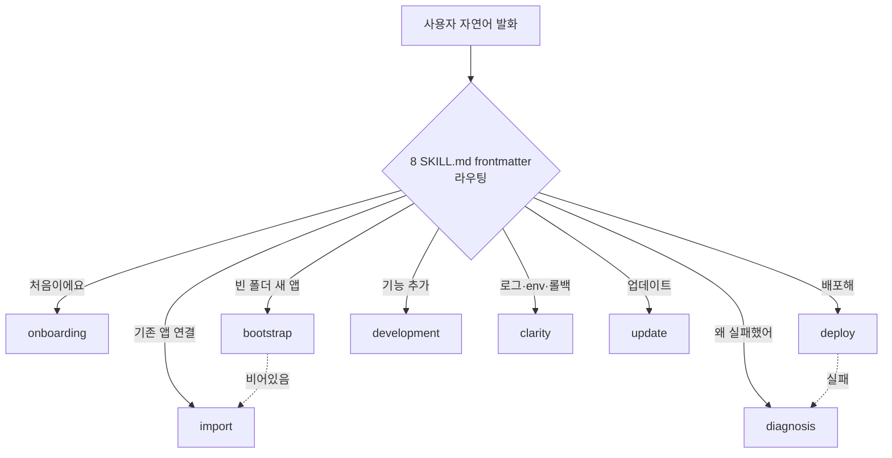

# 🚀 axhub 플러그인 아키텍처 가이드

> 한국어 자연어로 앱을 배포·관리하는 **Claude Code 플러그인** — 팀 온보딩용 문서예요.
> `/understand` 코드 분석(87 노드·158 관계·8 레이어)을 바탕으로 정리했어요.

| 항목 | 값 |
|---|---|
| **저장소** | `@jocoding-ax-partners/axhub-plugin-cc` (v1.9.0) |
| **한 줄 소개** | "배포해" 한마디로 앱 lifecycle 전체를 안전하게 굴리는 얇은 라우팅 레이어 |
| **구성** | 8 skill · SessionStart hook 2개 · Bun tooling · 문서 계약 테스트 |
| **핵심 의존** | `ax-hub-cli` (axhub 바이너리) v0.20.0+ 를 직접 호출 |
| **성격** | 런타임 앱이 아니라 **문서(Markdown)·정책·테스트 중심** 플러그인 |

---

## 📑 목차

1. [axhub 가 뭔가요?](#1-axhub-가-뭔가요)
2. [한눈에 보기](#2-한눈에-보기)
3. [핵심 개념: 8개 skill 라우팅 표면](#3-핵심-개념-8개-skill-라우팅-표면)
4. [아키텍처: 8개 레이어](#4-아키텍처-8개-레이어)
5. [동작 방식: 3가지 핵심 흐름](#5-동작-방식-3가지-핵심-흐름)
6. [안전장치와 정책](#6-안전장치와-정책)
7. [SessionStart hook (자동 업데이트)](#7-sessionstart-hook-자동-업데이트)
8. [빌드·품질·릴리즈 tooling](#8-빌드품질릴리즈-tooling)
9. [테스트: 문서가 정답인 코드베이스](#9-테스트-문서가-정답인-코드베이스)
10. [코드베이스 지도 (어디서 뭘 찾나)](#10-코드베이스-지도-어디서-뭘-찾나)
11. [새 팀원 12단계 온보딩 투어](#11-새-팀원-12단계-온보딩-투어)
12. [부록: 통계·용어·문서 출처](#12-부록-통계용어문서-출처)

---

## 1. axhub 가 뭔가요?

axhub 는 [axhub SaaS](https://axhub.ai) 를 도입한 회사의 **바이브코더**가 Claude Code 안에서 **한국어 자연어만으로** 앱을 만들고·배포하고·관리하게 해주는 플러그인이에요.

```
"결제 앱 만들어줘"  →  "GitHub 연결해"  →  "배포해"  →  "결과 봐"
```

이 한 줄들이 실제 배포 파이프라인을 끝까지 굴려요. 가장 중요한 설계 철학은 **'얇은 라우팅 레이어'** 예요.

> 💡 **판정·실행 로직은 전부 `ax-hub-cli` 에 있어요.**
> 플러그인은 자연어 의도를 알맞은 axhub 명령으로 **연결**하고, **안전 가드**만 챙겨요.
> 그래서 플러그인 자체엔 배포·앱 관리 로직이 없고, skill(Markdown 지침)과 안전장치가 대부분이에요.

---

## 2. 한눈에 보기

| 지표 | 수 | 설명 |
|---|---|---|
| 분석 파일 | **66개** | docs 34 · code 16 · config 14 · infra 2 |
| 언어 | 5종 | Markdown · TypeScript · JSON · YAML · JavaScript |
| skill | **8개** | 플러그인의 자연어 진입 표면 |
| 아키텍처 레이어 | 8개 | 아래 4번 참고 |
| 지식 그래프 노드 | 87개 | document 34 · function 21 · config 15 · file 15 · pipeline 2 |
| 지식 그래프 관계 | 158개 | documents 53 · related 38 · validates 23 · … |

> 📌 **문서가 절반을 넘어요.** 이 저장소는 "코드로 동작을 짜는" 프로젝트가 아니라, **skill(Markdown 지침)·정책 문서·문서 계약 테스트**로 이뤄진 플러그인이에요. 그래서 기여 대부분은 "코드 수정" 이 아니라 **"지침·정책 문구 다듬기"** 예요.

---

## 3. 핵심 개념: 8개 skill 라우팅 표면

플러그인의 **심장**이에요. 8개 `SKILL.md` 각각의 frontmatter(`description`·`examples`)만으로 사용자 발화를 알맞은 skill 로 갈라 보내요.

> 💡 **별도 학습 corpus 나 분류 코드가 전혀 없어요.** 라우팅 품질은 오로지 **frontmatter 문구**에 달려 있어요. 라우팅을 고치려면 코드가 아니라 "언제 쓰고 언제 다른 skill 로 양보하는지" 문장을 다듬어요.

| skill | 언제 쓰나 | 하는 일 | 양보 / handoff |
|---|---|---|---|
| **onboarding** | 처음 셋업·"처음인데"·getting started | CLI 설치·로그인·GitHub App·앱 연결을 detect-first 로 안내, 최종 Ready card | 빈 폴더 자동 bootstrap ❌ |
| **bootstrap** | **빈 디렉토리**에 새 앱 만들기 | template picker → 앱 이름 → GitHub owner → preview → `axhub apps bootstrap` 생성·배포 | 비어있지 않으면 → import |
| **import** | **기존 로컬 앱**을 첫 연결 | manifest·GitHub·첫 배포 준비까지 `import/v1` envelope 계약으로 가져오기 | 빈 폴더면 → bootstrap |
| **deploy** | 연결된 앱 **재배포** | preview-confirm → dry-run → verify 로 성공 선언 (static 은 `active_release_id`) | 실패 시 → diagnosis |
| **development** | 앱에 **기능 코드** 추가 | connector·table 실데이터 화면, CRUD·검색·폼 (read 전용 v1) | 배포는 → deploy |
| **diagnosis** | 배포 **실패 원인** 진단 | MCP `deployment_diagnosis` 로 원인·해결 후보를 **읽기 전용** 요약 | 재배포·롤백 직접 실행 ❌ |
| **clarity** | 위에 안 맞는 **CLI 운영** | 상태·환경변수·로그·롤백·테이블·데이터 조회를 `--help`/`--json-schema` 라이브 탐색으로 실행 | 앱 코드는 → development |
| **update** | CLI·플러그인 **버전 최신화** | 수동 on-demand 로 확인·업데이트, 최신이어도 한 줄 안내 | 셋업은 → onboarding |



---

## 4. 아키텍처: 8개 레이어

66개 파일을 역할별로 8개 레이어에 정확히 1번씩 배정했어요. **디렉토리 구조 = 레이어 경계**예요.

| 레이어 | 파일 | 역할 | 대표 경로 |
|---|---|---|---|
| 🎯 **Skill 라우팅 표면** | 8 | 자연어를 각 skill 로 갈라 보내는 진입 표면 | `skills/*/SKILL.md` |
| 📚 **Skill 참조 문서** | 18 | 상세 실행 흐름·에러 카탈로그·guardrail (progressive disclosure) | `skills/*/references/*.md` |
| ⚖️ **정책·거버넌스** | 5 | 모든 skill 이 따를 권위 규범 (AP·DP 규칙) | `docs/policy/`, `POLICY.md`, `CLAUDE.md`, `AGENTS.md` |
| 🔌 **플러그인 manifest·hook** | 4 | Claude Code 에 플러그인 등록·노출 + SessionStart hook | `.claude-plugin/`, `hooks/` |
| 🛠️ **빌드·릴리즈·품질 tooling** | 5 | clean bundle·context budget·tone lint·release | `scripts/*.ts` |
| ✅ **테스트·routing fixture** | 18 | SKILL 계약·UX·frontmatter·정책 parity 검증 | `tests/`, `tests/routing/*.fixture.json` |
| ⚙️ **CI/CD pipeline** | 2 | nightly E2E 회귀 + 태그 릴리즈·Slack 알림 | `.github/workflows/` |
| 📄 **프로젝트 문서·설정** | 6 | README·CHANGELOG + toolchain·릴리즈 설정 | `README.md`, `package.json`, `tsconfig.json` … |

---

## 5. 동작 방식: 3가지 핵심 흐름

### 흐름 A — 처음 사용자의 첫 앱 (first-run)

```
onboarding ─► bootstrap ─► deploy(verify)
(CLI 설치·로그인    (빈 폴더에 템플릿으로    (배포 → verify 1회로
 ·GitHub 연결)       새 앱 생성+배포)         성공 선언)
        │
        └─ (기존 앱이면) ─► import ─► deploy
```

### 흐름 B — 배포와 실패 진단

```
deploy ──► preview 카드 ──► 사용자 확인 ──► dry-run ──► execute ──► verify(1회)
                                                            │
                                              (terminal 실패) ▼
                                                        diagnosis  ← 읽기 전용 원인 요약
                                                        (재배포·롤백은 사용자 몫)
```

### 흐름 C — day-2 운영·개발

| 하고 싶은 것 | skill | 예시 |
|---|---|---|
| 앱에 기능 화면 추가 | **development** | "유저 목록 페이지 만들어", "todo 검색 추가" |
| 앱 운영 (조회·설정) | **clarity** | "로그 보여줘", "환경변수 설정", "롤백" |
| 버전 최신화 | **update** | "axhub 최신으로", "플러그인 업데이트" |

---

## 6. 안전장치와 정책

되돌리기 어려운 작업(배포·삭제)에서 사고가 나지 않도록, 여러 겹의 가드가 있어요. 이 규칙들의 **단일 진실**은 `docs/policy/agent-policy.md` (AP-1~AP-13) 예요.

| 안전장치 | 무엇을 막나 |
|---|---|
| **Preview-confirm gate** | 배포처럼 위험한 작업은 항상 **미리보기 카드 → 사용자 확인** 뒤에만 실행 |
| **Verify 기반 성공 선언** | `axhub deploy verify` **1회 성공** 전까지 "배포 성공" 이라 말하지 않아요 (latest 재탐색 금지) |
| **AP-11 맥락 가드** | axhub 맥락(폴더 연결·대화 언급·직전 작업)이 있을 때만 트리거 — 맥락 없는 "배포해" 는 밀어붙이지 않아요 |
| **AP-12 진입 확인 AUQ** | deploy·bootstrap·import 실행 전 "axhub로 진행할까요?" 한 번 더 확인 |
| **AP-13 Windows 계약** | Windows 에선 axhub 명령을 **Git Bash 전용**으로 실행 (PowerShell 금지) |
| **diagnosis 읽기 전용** | 실패 진단은 원인만 요약, 재배포·롤백 직접 실행 ❌ |
| **파괴적 변경 승인** | 삭제·롤백·`--force`/`--execute` 는 사용자 승인 필요 |

> ⚖️ **정책 계층 구조**: `agent-policy.md`(원본) → `CLAUDE.md`(에이전트용 요약) + `POLICY.md`(사용자 공개용 요약). 요약본이 원본과 어긋나면 `tests/policy-parity.test.ts` 가 잡아요.

---

## 7. SessionStart hook (자동 업데이트)

`hooks/hooks.json` 에 **2개의 SessionStart hook** 이 등록돼 있고, Claude Code 가 `plugin.json` 선언 없이 자동 발견해요.

| hook | 하는 일 | 끄기 |
|---|---|---|
| **auto-update** | 24h throttle 로 CLI·플러그인 새 버전 확인·적용 (`auto-update-prompt.md` 절차서 사용) | `AXHUB_NO_AUTO_UPDATE=1` |
| **온보딩 MCP 재시작 resume** | `claude mcp add` 후 재시작이 필요할 때, 다음 세션에서 온보딩 마무리 이어가기 | `AXHUB_NO_ONBOARDING_RESUME=1` |

> 💡 auto-update 는 매번 네트워크를 때리지 않으려고 **캐시 파일 mtime(24h)만 보는 cheap 게이트**로 throttle 하고, 실패해도 조용히 건너뛰는 best-effort·비차단 방식이에요. 이 자동 hook 의 **수동 짝**이 `update` skill 이에요 (throttle 없이 지금 바로 확인).

---

## 8. 빌드·품질·릴리즈 tooling

`scripts/` 의 Bun 스크립트들이 빌드와 quality gate 를 자동화해요.

| 스크립트 | 역할 |
|---|---|
| `build-plugin-bundle.ts` | `.claude`·`node_modules` 등 개발 산출물을 걸러 `dist/axhub-plugin` 에 **clean bundle** 생성 |
| `check-plugin-context-budget.ts` | skill 별 **byte·token 한도**(progressive disclosure 예산) 강제 |
| `check-toss-tone-conformance.ts` | 금지된 격식체(비-해요체) 종결어미를 잡아 **해요체 tone** 유지 |
| `release-tag.ts` | 릴리즈 flow 중 **tag 생성·push** 담당 |
| `version-updater-marketplace.cjs` | `marketplace.json` 버전 동기화 |

> 🏷️ **릴리즈는 2단계**: `bun run release`(bump+commit) → CHANGELOG narrative 손질 → `bun run release:tag`(tag push). tag 를 마지막에 떼어내 릴리즈 노트를 다듬을 틈을 만들어요.

**살아남은 quality gate**: `lint:tone --strict` (해요체 0 err) · frontmatter 유효성 · 대표 여정 회귀 · `plugin:bundle` clean bundle.

---

## 9. 테스트: 문서가 정답인 코드베이스

이 플러그인의 '정답' 은 코드 동작보다 **문서 계약**이라, 테스트도 문서를 읽어 검증해요. (그래프에서 `validates` 관계 23개로 표현돼요.)

| 테스트 | 무엇을 지키나 |
|---|---|
| `frontmatter.test.ts` | 8개 SKILL.md 의 frontmatter 유효성 |
| `smooth-behavior.test.ts` | 자연어 routing + UX 발화 계약 (진입 확인·해요체·no-preamble) |
| `policy-parity.test.ts` | agent-policy 원본 ↔ 요약본 대조 |
| `import-skill-contract.test.ts` | import shim 을 실제로 돌려 envelope fail-closed 계약 확인 |
| `*-routing.fixture.json` | 각 skill 의 라우팅 결정을 회귀로 고정 (skill 당 1개) |

---

## 10. 코드베이스 지도 (어디서 뭘 찾나)

```
axhub/
├── .claude-plugin/         🔌 plugin.json (등록) · marketplace.json (노출)
├── .github/workflows/      ⚙️ claude-cli-e2e.yml (nightly E2E) · release.yml (릴리즈)
├── docs/policy/            ⚖️ agent-policy.md (AP 규칙, 단일 진실) · dev-policy.md (DP)
├── hooks/                  🔄 hooks.json · auto-update-prompt.md (SessionStart hook)
├── scripts/                🛠️ bundle · context-budget · tone lint · release-tag
├── skills/                 🎯 8개 skill — 플러그인의 핵심
│   └── <skill>/
│       ├── SKILL.md        └ 라우팅 frontmatter + 얇은 본문
│       └── references/     └ 📚 상세 흐름 (on-demand 로만 로드)
├── tests/                  ✅ 문서 계약 검증 + routing/ fixture
├── README.md               📄 프로젝트 소개 (사용자 여정의 지도)
├── CLAUDE.md / AGENTS.md   ⚖️ 에이전트 행동 요약
├── POLICY.md               ⚖️ 사용자 공개 정책
└── package.json            📄 Bun tooling · 릴리즈 스크립트
```

> 🔎 **작업별 진입점**
> - 라우팅 오탐 고치기 → 해당 `skills/*/SKILL.md` 의 frontmatter `description`
> - 배포 흐름 세부 → `skills/deploy/references/workflow-details.md`
> - 정책 바꾸기 → `docs/policy/agent-policy.md` (그리고 요약본 3개 + parity 테스트)
> - 에러 메시지 톤 → `skills/deploy/references/error-empathy-catalog.md`

---

## 11. 새 팀원 12단계 온보딩 투어

코드를 처음 보는 팀원이 순서대로 따라가면 전체 구조가 잡히는 학습 경로예요.

| # | 단계 | 핵심 |
|---|---|---|
| 1 | **프로젝트 개요** | README — "얇은 라우팅 레이어" 철학과 대표 여정 |
| 2 | **manifest 등록** | `plugin.json` 이 skills/ 를 자동 discovery, `marketplace.json` 으로 발견·설치 |
| 3 | **Skill 라우팅 표면** | frontmatter 만으로 라우팅 (corpus 없음) + AP-11 맥락 전제 |
| 4 | **앱 만들기·가져오기** | bootstrap(빈 폴더) ↔ import(기존 앱) 한 쌍 |
| 5 | **배포와 실패 진단** | deploy(verify 성공 선언) ↔ diagnosis(읽기 전용) 한 쌍 |
| 6 | **기능 개발·CLI 운영** | development(기능 코드) · clarity(CLI 브리지) |
| 7 | **참조 문서** | progressive disclosure — 얇은 본문 + on-demand 상세 |
| 8 | **정책·거버넌스** | agent-policy 가 단일 진실, 요약본 3개 + parity |
| 9 | **SessionStart hook** | auto-update(24h throttle) + 온보딩 resume |
| 10 | **빌드·품질 tooling** | bundle · context-budget · tone · 2단계 릴리즈 |
| 11 | **계약 테스트** | 문서를 읽어 routing·UX·정책을 검증 |
| 12 | **CI/CD** | nightly E2E(비용 통제) + 태그 릴리즈. README 약속으로 한 바퀴 |

> 💡 **인터랙티브 버전**: `.understand-anything/` 지식 그래프를 `/understand-dashboard` 로 열면 위 투어와 노드·관계를 **웹에서 시각적으로** 탐색할 수 있어요.

---

## 12. 부록: 통계·용어·문서 출처

### 지식 그래프 통계

- **노드 87개** — document 34 · function 21 · config 15 · file 15 · pipeline 2
- **관계 158개** — documents 53 · related 38 · validates 23 · contains 21 · configures 12 · exports 5 · depends_on 2 · tested_by 2 · triggers 1 · imports 1

### 자주 나오는 용어

| 용어 | 뜻 |
|---|---|
| **ax-hub-cli** | 판정·실행 로직을 담은 axhub 바이너리 (플러그인이 호출) |
| **frontmatter 라우팅** | SKILL.md 상단 메타(`description`·`examples`)로 skill 을 고르는 방식 |
| **progressive disclosure** | 얇은 SKILL.md + 필요할 때만 읽는 references 구조 |
| **preview-confirm** | 위험한 작업 전 미리보기 카드 → 사용자 확인 게이트 |
| **verify 성공 선언** | `deploy verify` 1회 성공으로만 배포 성공을 인정 |
| **AP / DP** | Agent Policy / Dev Policy 규칙 번호 (agent-policy.md·dev-policy.md) |

### 이 문서는 어떻게 만들어졌나

`/understand . --full --language ko` 로 저장소를 분석해 `.understand-anything/knowledge-graph.json` 을 생성하고, 그 그래프의 레이어·투어·skill 요약을 바탕으로 이 문서를 정리했어요. 코드가 바뀌면 `/understand` 를 다시 돌려 그래프를 갱신하고 이 문서도 업데이트하면 돼요.

---

*문서 기준 커밋: `c0699d0` · axhub-plugin-cc v1.9.0*
