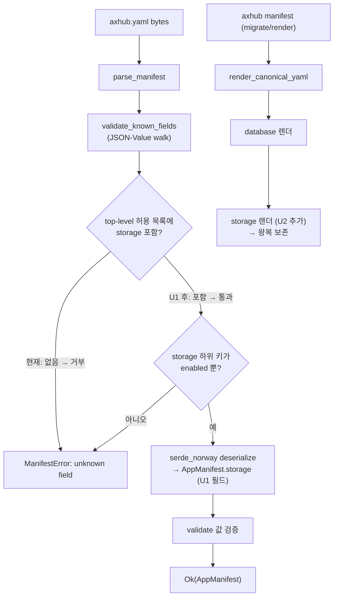

# feat: axhub-cli·plugin storage 매니페스트 정합성

> **Target repos:** 주 대상은 `axhub-cli` (U1·U2, 현재 폴더에 체크아웃 안 됨 — 경로는 axhub-cli HEAD 기준). 보조로 이 plugin repo `axhub` (U3). 플랜 문서는 이 repo의 `docs/plans/`에 있어요. 각 유닛에 대상 repo를 명시했어요.

---

## Product Contract

### Summary

백엔드 spec 138–140로 도입된 선언형 파일 스토리지(`axhub.yaml`의 `storage.enabled: true`)에 CLI·plugin 매니페스트 도구를 맞춰요. 핵심은 CLI 매니페스트 파서가 `storage` 섹션을 **알게** 해서, 백엔드가 받아들이는 매니페스트를 CLI가 거부하지 않게 하는 거예요.

### Problem Frame

백엔드는 `storage:` top-level 키를 받아 배포 시 스토리지를 프로비저닝해요(spec 140, prod 활성). 반면 CLI 크레이트 `axhub-manifest`는 `parse_manifest` → `validate_known_fields` → `reject_unknown_keys`로 **백엔드 `KnownFields(true)`를 미러링한 수동 strict 검증**을 하는데, 그 top-level 허용 목록에 `storage`가 없어요. 결과:

- 사용자가 `storage.enabled: true`를 `axhub.yaml`에 넣고 `axhub deploy --explain`을 돌리면 CLI가 **unknown field**로 거부해요. 이 `--explain`은 plugin `import` 스킬의 매니페스트 검증 게이트(`manifest-authoring.md`)라, storage를 쓰는 앱의 import 보강이 막혀요.
- `axhub manifest`(migrate/canonical 재렌더)는 struct에 `storage`가 없어 파싱 시 **선언을 드롭**해요.

> **정정 노트:** 초기 조사에서 CLI를 "lenient(unknown 무시)"로 판단했으나, 크레이트는 `serde(deny_unknown_fields)` 대신 JSON-Value 워크(`validate_value_known_fields`)로 strict 검증을 손수 구현했어요. 테스트 `rejects_unknown_field_for_backend_alignment`가 이 백엔드-정합 의도를 못박아요. 따라서 이 작업은 "consistency nice-to-have"가 아니라 **CLI 경로에서 storage 앱을 풀어주는 correctness 수정**이에요.

### Requirements

| ID | 요구사항 |
|----|----------|
| R1 | `parse_manifest`가 top-level `storage.enabled`를 unknown으로 거부하지 않고 파싱해요 (`axhub deploy --explain`·`axhub manifest` 성공). |
| R2 | `storage` 하위의 미지 키(예: `storage.foo`)는 여전히 거부해요 — 백엔드 strict 정합 유지. |
| R3 | canonical 렌더(`axhub manifest` migrate/재렌더)가 `storage.enabled`를 보존해요 — 왕복에서 드롭 없음. |
| R4 | plugin `import`이 파일 스토리지 근거가 분명한 앱에 한해 `storage.enabled`를 매니페스트에 선언할 수 있고, 그 보강본이 `axhub deploy --explain`을 통과해요. |
| R5 | storage는 opt-in — `axhub init`은 기본으로 `storage`를 스캐폴딩하지 않아요. |

### Scope Boundaries

**In scope**
- `axhub-cli` 매니페스트 크레이트의 storage 파싱·strict 검증·canonical 렌더 (U1·U2).
- 이 plugin repo `axhub`의 `import` 매니페스트 authoring 스키마 문서 보강 (U3).

**Out of scope**
- 백엔드 변경 — 이미 배포·prod 활성 (spec 138–140).
- 콘솔/FE 파일 브라우저, 앱↔S3 바이트 경로 (불변).

#### Deferred to Follow-Up Work
- 새 `axhub storage` 명령 표면(enable / list / usage)으로 백엔드 콘솔 API를 감싸는 트랙 — 별도 신규 기능. 이번 정합성 패치에 포함하지 않아요.

---

## Planning Contract

### Key Technical Decisions

- **KTD1 — 기존 hand-rolled 패턴 유지 (serde `deny_unknown_fields` 도입 안 함).** `validate_value_known_fields`의 top-level 허용 목록에 `"storage"`를 더하고, 중첩 `reject_unknown_keys(storage, &["enabled"])`를 추가해요. 근거: 크레이트가 의도적으로 known-fields를 손수 구현해 백엔드 `KnownFields`와 에러 메시지·동작을 맞추고 있어요(R2). serde 스위치는 이 정합 패턴을 깨요.
- **KTD2 — `StorageSection { enabled: bool }` 값 타입으로 백엔드 미러.** 백엔드 `AppManifestStorage{ Enabled bool }`와 동일하게 `#[serde(default)]` 값 타입(Option 아님)으로 둬요. `DatabaseSection` 패턴을 참고하되 Option 래핑은 하지 않아요(미선언=enabled:false).
- **KTD3 — 두 키 목록을 함께 갱신.** 실제 거부를 가르는 `validate_value_known_fields`의 inline 배열 **그리고** `CANONICAL_TOPLEVEL_KEYS`(backend-canonical 문서·렌더 순서용) 둘 다에 `"storage"`를 `database` 뒤로 추가해요. 백엔드 필드 순서(`…env, ci, database, storage`)와 정렬.
- **KTD4 — storage는 opt-in.** `axhub init`은 `storage`를 emit하지 않아요. `CANONICAL_TOPLEVEL_KEYS`에 넣는 건 "허용된 backend-canonical 키" 문서화·렌더 순서 목적이지 init 스캐폴딩 대상이 아니에요(R5).
- **KTD5 — plugin import는 근거 기반으로만 storage 선언.** `manifest-authoring.md`의 "직접 근거가 있는 값만 적고, 불확실하면 비워요" 규칙을 그대로 따라, S3 SDK 사용·파일 업로드 의존성 같은 분명한 파일 스토리지 신호가 있을 때만 `storage.enabled: true`를 적어요. 기본으로 넣지 않아요.

### Assumptions
- `axhub deploy`(비-explain preview) 경로도 `parse_manifest`를 공유해 client-side 검증하리라 가정해요 — 미검증. U1 검증 단계에서 `deploy/create.rs`가 같은 파서를 타는지 확인해요.
- axhub-cli 크레이트의 경로·라인 참조는 GitHub HEAD 기준이에요. 구현 시점에 크레이트가 소폭 이동했을 수 있어 재확인이 필요해요.

---

## High-Level Technical Design

`parse_manifest` 검증 파이프라인과 U1의 세 삽입 지점(top-level 허용 목록·중첩 검증·struct 필드)이에요. canonical 렌더(U2)는 별도 명령 경로예요.

*방향성 참고용이에요 — 정확한 시그니처·에러 문자열은 구현이 정해요.*

---

## Implementation Units

### U1. axhub-cli 매니페스트 크레이트에 storage 파싱·strict 검증 추가

- **Goal**: `axhub-manifest` 크레이트가 top-level `storage.enabled`를 파싱·수용하고, storage 하위 미지 키는 거부하도록 해요.
- **Requirements**: R1, R2, R5
- **Dependencies**: 없음
- **Repo / Files** (`axhub-cli`):
  - `crates/axhub-manifest/src/lib.rs` — `StorageSection` 신규 struct + `AppManifest.storage` 필드; `CANONICAL_TOPLEVEL_KEYS`에 `"storage"`; `validate_value_known_fields` top-level inline 배열에 `"storage"` + 중첩 `reject_unknown_keys(storage, &["enabled"])`
  - `crates/axhub-manifest/src/lib.rs`의 `#[cfg(test)] mod tests` — 신규 테스트
- **Approach**:
  - `DatabaseSection` 정의를 패턴으로 `#[derive(Debug, Clone, Serialize, Deserialize, PartialEq, Eq, Default)] pub struct StorageSection { #[serde(default)] pub enabled: bool }` 추가 (KTD2).
  - `AppManifest`에 `#[serde(default)] pub storage: StorageSection`를 `database` 필드 뒤에 추가.
  - `CANONICAL_TOPLEVEL_KEYS` 배열 끝(`"database"` 뒤)에 `"storage"` 추가 (KTD3).
  - `validate_value_known_fields`의 top-level `reject_unknown_keys(root, &[...])` 배열에 `"storage"` 추가하고, `ci` 블록 옆에 `if let Some(storage) = root.get("storage").and_then(Value::as_object) { reject_unknown_keys(storage, &["enabled"])?; }` 추가 (KTD1).
- **Execution note**: 먼저 `storage.enabled` 수용을 검증하는 실패 테스트를 추가한 뒤 허용 목록을 고치는 순서가 회귀를 명확히 해요. 시작 전 두 소비처를 확인해요 — `deploy/create.rs`가 `parse_manifest`를 공유하는지(R1 영향 범위), 그리고 `initcmd.rs`가 `CANONICAL_TOPLEVEL_KEYS`를 어떻게 쓰는지(검증용인지 emit용인지 — KTD4 opt-in 보존 여부).
- **Patterns to follow**: 같은 파일의 `DatabaseSection` struct 정의, `reject_unknown_keys(database, &["engine"])` 중첩 검증, 기존 테스트 `rejects_unknown_database_engine` / `rejects_unknown_field_for_backend_alignment`.
- **Test scenarios** (`crates/axhub-manifest/src/lib.rs` tests):
  - Happy: `parse_manifest(b"version: axhub/v1\nstorage:\n  enabled: true\n")` → `Ok`, `manifest.storage.enabled == true`.
  - Happy(default): storage 미선언 매니페스트 → `storage.enabled == false`, 파싱 성공(회귀 없음).
  - Error: `parse_manifest(b"storage:\n  bucket: x\n")` → `Err` (storage 하위 미지 키 거부, R2).
  - Edge: `storage: {}` (빈 맵) → `Ok`, `enabled == false`.
  - Parity: 기존 `rejects_unknown_field_for_backend_alignment` 계열이 여전히 green (top-level 미지 키는 계속 거부).
  - Regression(init): `CANONICAL_TOPLEVEL_KEYS`에 `storage` 추가 후 `axhub init` 출력이 `storage:`를 새로 emit하지 않음 (initcmd.rs가 const를 emit용으로 순회한다면 이 케이스가 잡아냄 — KTD4 opt-in 보존).
- **Verification**: `cargo test -p axhub-manifest` green; storage 매니페스트에 대해 `axhub deploy --explain --json`이 exit 0 + `status: ok`; `axhub init` 출력에 `storage`가 새로 나타나지 않음.

### U2. canonical 렌더에 storage 보존 추가

- **Goal**: `axhub manifest`의 canonical 재렌더/migrate가 `storage.enabled`를 드롭하지 않고 다시 써내요.
- **Requirements**: R3
- **Dependencies**: U1 (`AppManifest.storage` 필드 필요)
- **Repo / Files** (`axhub-cli`):
  - `axhub/src/commands/manifest.rs` — `render_canonical_yaml`에 storage 렌더 arm 추가; 같은 파일 tests에 round-trip 테스트
- **Approach**: `database` 렌더 블록(`if let Some(database) = &manifest.database { … }`) 뒤에 `if manifest.storage.enabled { out.push_str("storage:\n  enabled: true\n"); }` 형태의 arm을 추가해 백엔드 필드 순서(database→storage)와 정렬 (KTD3). `enabled == false`면 emit하지 않아 opt-in 유지 (KTD4).
- **Execution note**: 신규 도메인 동작이므로 round-trip 테스트 우선(test-first).
- **Patterns to follow**: 같은 함수의 `database` 렌더 블록과 `yaml_scalar` 사용, 기존 테스트 `render_canonical_yaml` round-trip 케이스.
- **Test scenarios** (`axhub/src/commands/manifest.rs` tests):
  - Happy: `storage.enabled: true`인 파싱본을 렌더 → 출력에 `storage:` + `enabled: true` 포함; 재파싱 시 `storage.enabled == true` (왕복 보존, R3).
  - Edge: `storage.enabled: false`(또는 미선언) → 출력에 `storage:` 미포함 (opt-in, KTD4).
- **Verification**: `cargo test -p axhub` (manifest 모듈) green; 수동으로 storage 매니페스트에 `axhub manifest migrate` 후 `storage.enabled`가 남아 있음.

### U3. plugin import 매니페스트 authoring 스키마에 storage 문서화

- **Goal**: `import` 스킬이 파일 스토리지 근거가 분명한 앱에 한해 `storage.enabled`를 매니페스트에 적을 수 있도록 스키마를 문서화해요.
- **Requirements**: R4, R5
- **Dependencies**: 문서 변경 자체는 U1·U2와 병렬이에요. 단, plugin이 실제로 `storage.enabled`를 **기입**하는 동작은 U1 포함 axhub-cli 릴리즈 배포에 묶여야 해요 (Risks의 'U3 선행-배포 위험' 참고) — 구 CLI에서 `--explain` 거부→degrade로 선언이 유실되기 때문이에요.
- **Repo / Files** (`axhub`, 이 repo):
  - `skills/import/references/manifest-authoring.md` — "채우는 필드(axhub.yaml 정규 스키마)" 목록에 `storage` 항목 1줄 추가
- **Approach**: `database` 항목 아래에 `storage`: `enabled` 항목을 1줄 추가하되 "파일 스토리지가 분명히 필요할 때만(S3 SDK·파일 업로드 의존성 등 근거가 있을 때) `enabled: true`"로 조건을 달아요. 기존 "직접 근거가 있는 값만 적고, 불확실하면 비워요" 그라운딩 규칙에 종속시켜 기본 미선언 유지 (KTD5, R5).
- **Execution note**: 문서 전용 — 동작 코드 없음. tone·byte-budget 게이트만 통과하면 돼요.
- **Patterns to follow**: 같은 파일의 `database`·`env` 항목 서술 방식, 해요체 톤.
- **Test scenarios**: `Test expectation: none — 문서 변경(동작 코드 없음)`. 대신 아래 게이트로 회귀 방지:
  - `bun run lint:tone --strict` 통과 (해요체, 금지어 없음).
  - `tests/plugin-context-budget.test.ts` 통과 (import 스킬 byte 예산 초과 안 함).
  - `tests/frontmatter.test.ts`·`tests/import-skill-contract.test.ts`·`tests/smooth-behavior.test.ts` 통과 (smooth-behavior 도 manifest-authoring.md 를 읽으므로 함께 확인 — envelope 계약 불변, 스키마 필드 목록은 계약 테스트 대상 아님).
- **Verification**: 위 게이트 green; `manifest-authoring.md`에 `storage: enabled` 항목이 근거 조건과 함께 존재.

---

## Risks & Dependencies

- **크레이트 drift (중)**: axhub-cli 경로·라인은 GitHub HEAD 스냅샷이에요. 구현 착수 시 `crates/axhub-manifest/src/lib.rs`의 `AppManifest`·`validate_value_known_fields`·`CANONICAL_TOPLEVEL_KEYS` 현재 형태를 먼저 재확인해요.
- **deploy preview 경로 미검증 (중)**: `axhub deploy`(비-explain)가 `parse_manifest`를 공유하는지 U1 착수 시 확인 — 공유한다면 이번 수정으로 배포 preview도 함께 풀려요.
- **repo 분리 (하)**: U1·U2는 `axhub-cli`, U3은 이 repo예요. 두 repo의 커밋·릴리즈가 분리돼 있어, storage 앱의 end-to-end 정상화는 axhub-cli 릴리즈가 배포된 뒤에 완성돼요(R4의 실동작 의존).
- **U3 선행-배포 위험 (중)**: U1 포함 axhub-cli 릴리즈 배포 전에 U3이 반영되면, import가 파일 스토리지 근거로 `storage.enabled: true`를 적은 매니페스트가 구 CLI의 `axhub deploy --explain`에서 거부돼 최소 manifest로 degrade하고 **storage 선언이 조용히 사라져요**. 따라서 U3의 plugin authoring(실제 기입)은 U1을 포함한 최소 CLI 버전 게이트(CLAUDE.md의 min-CLI 게이트)에 묶어야 해요 — 문서만 먼저 넣고 실제 storage 기입은 그 게이트 뒤로 미루는 방식이 안전해요. 게이트 메커니즘 자체는 구현 판단이에요.

---

## Sources & Research

- 백엔드 파일 스토리지: `axhub-backend` PR #612 (spec 138), #619 (spec 139), #620 (spec 140), #622 (prod 게이트 ON), #623/#624 (콘솔 API).
- 매니페스트 storage 계약: `axhub-backend` `internal/contexts/deploy/domain/manifest/manifest.go` — `AppManifestStorage{ Enabled bool }`, 필드 순서 `…env, ci, database, storage`. spec 140 quickstart의 `storage.enabled: true` 선언 형식.
- CLI strict 검증: `axhub-cli` `crates/axhub-manifest/src/lib.rs` — `parse_manifest`→`validate_known_fields`→`validate_value_known_fields`(top-level inline 허용 목록), `CANONICAL_TOPLEVEL_KEYS`, 테스트 `rejects_unknown_field_for_backend_alignment`. canonical 렌더: `axhub/src/commands/manifest.rs` `render_canonical_yaml`. init 소비처: `axhub/src/commands/initcmd.rs`.
- plugin import authoring: 이 repo `skills/import/references/manifest-authoring.md`, 계약 테스트 `tests/import-skill-contract.test.ts`(envelope 스키마만 검증).

---

## Definition of Done

- **axhub-cli (U1·U2)**: `parse_manifest`가 `storage.enabled`를 수용하고 `storage.<미지키>`를 거부; canonical 렌더가 `storage.enabled`를 왕복 보존; `cargo test -p axhub-manifest` + manifest 명령 테스트 green; storage 매니페스트에 `axhub deploy --explain --json`이 `status: ok`.
- **axhub (U3)**: `manifest-authoring.md`에 근거-조건부 `storage: enabled` 항목 존재; `lint:tone --strict` + `plugin-context-budget` + `frontmatter` + `import-skill-contract` 게이트 green.
- 정정 사항(초기 "lenient" 판단 → 실제 strict 검증)이 Problem Frame에 기록됨.
