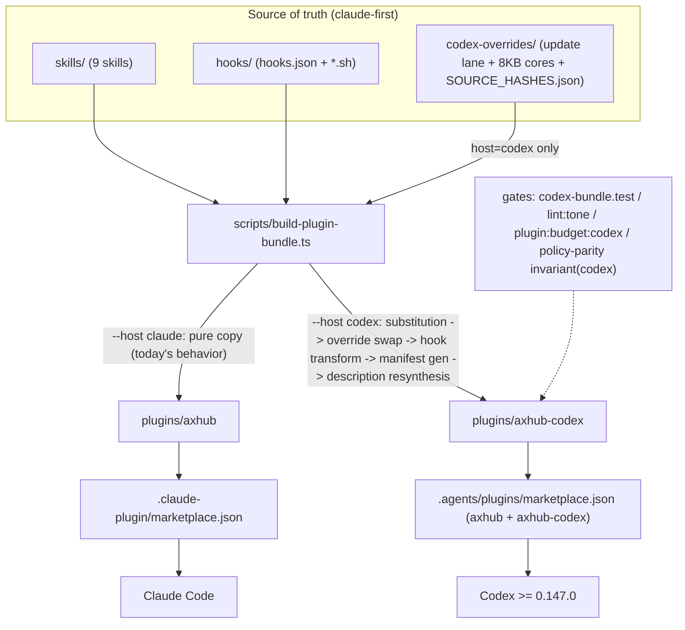
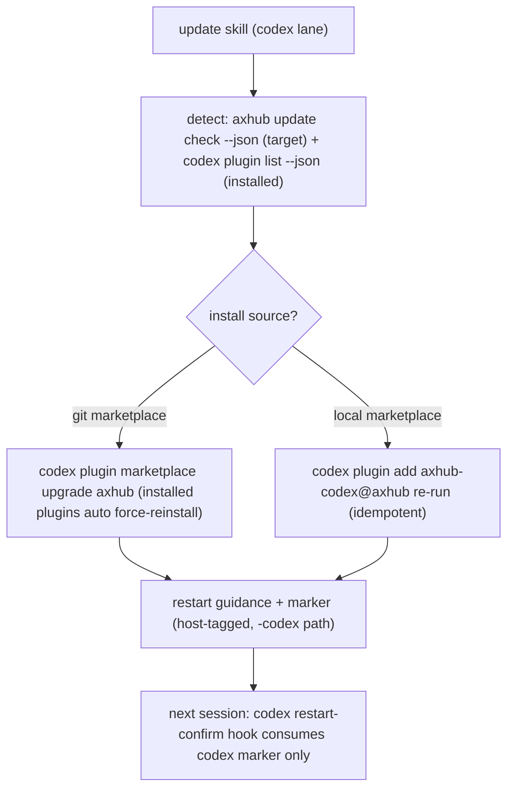

# Codex Plugin Compatibility - Plan

## Goal Capsule

- **Objective:** axhub Claude Code 플러그인을 Codex CLI(≥ 0.147.0)에서 공식 지원해요. 소스는 claude-first 단일 트리로 유지하고, 빌드 타임 transform 이 codex 전용 파생 번들(`plugins/axhub-codex`)을 생성해요. 완료 기준은 파괴 경로 QA 를 통과한 첫 "codex 지원 선언" 릴리즈예요.
- **Authority hierarchy:** 이 플랜 → 원 연구 문서(`codex-플러그인-호환-연구.md`) → 기존 정책 문서(`docs/policy/`). 충돌 시 구현 방식은 이 플랜의 KTD 가 우선하고, 제품 스코프 변경은 사용자 확인이 필요해요.
- **Stop conditions:** U1 실측이 Open Questions 의 전제를 깨면 해당 유닛을 멈추고 재설계를 보고해요. U10 파괴 경로 QA 는 태그·엔트리 병합 전에 릴리즈 후보에서 실행해요 — 실패 시 codex 노출(엔트리 병합·지원 선언) 없이 Claude-only 릴리즈로 진행하고 원인을 후속 유닛으로 등록하며, 이미 병합된 노출이 발견되는 예외에만 `.agents/plugins/marketplace.json` 의 axhub-codex 엔트리 revert 를 백스톱으로 써요. `~/.codex` 쓰기가 필요해 보이는 순간 즉시 멈춰요 — 전 과정 읽기 전용이에요.
- **Execution profile:** repo 로컬 작업 + 격리 `CODEX_HOME` 검증. codex 실모델 세션은 U1·U10 의 검증 목적에만 사용해요.
- **Tail ownership:** Scope Boundaries 의 Deferred 항목(소스 8KB 재구조화, codex e2e 자동화 등)은 이 플랜의 DoD 밖이에요.

---

## Product Contract

### Summary

Codex 가 Claude 플러그인 형식을 그대로 소비한다는 실측 위에서, 빌드 파생 이중 번들로 codex 를 2차 지원 host 로 추가해요. 이 플랜은 격리 실세션 스모크(P0)부터 소스 공통 개선(P0.5), transform 본체와 게이트(P1), 파괴 경로 QA 를 통과한 첫 지원 릴리즈까지를 커버해요.

### Problem Frame

axhub 플러그인은 Claude Code 전용으로 설계됐지만, Codex CLI 0.147.0 은 Claude 플러그인 형식(marketplace·hooks.json·SKILL.md·`CLAUDE_PLUGIN_ROOT` env)을 직접 소비해요. 현행 번들은 codex 에 설치·로드까지 되지만 품질이 "우연 동작" 수준이에요: update 스킬이 codex 에 없는 `claude plugin update --scope` 를 실행하려 들고, codex 의 8,000B 스킬 본문 절단이 승인 게이트·verify 성공 선언을 잘라내고, 훅 문안(suppressOutput 미구현으로 노출됨)과 상태 파일이 Claude 전제예요. 문안 병기는 skill byte 예산(잔여 7,063B)상 불가능해서, 소스를 건드리지 않는 파생 번들 구조가 필요해요.

### Requirements

**호환 표면**

- R1. codex 사용자가 `codex plugin marketplace add jocoding-ax-partners/axhub` → `codex plugin add axhub-codex@axhub` 두 명령으로 설치할 수 있어요 (Codex CLI ≥ 0.147.0).
- R2. codex 세션 카탈로그에 9개 스킬이 로드되고 frontmatter description 라우팅이 동작해요. codex 판 description 은 examples 대표 트리거를 병합한 재합성본(≤ 1,024자)이고, 9개 합산은 카탈로그 최소 예산 내여야 해요(상한 값은 U1 실측으로 확정, 보수 기본 ≤ 6,000자 — 초과 시 플러그인 스킬이 통째로 조용히 omit 되는 절단 특성 대응). U1-(k) 실측(계측 단위·관찰 한계·안전 margin·codex 버전)은 fixture 로 기록하고 `plugin:budget:codex` 가 그 값을 소비해요.
- R3. 실행 4스킬(bootstrap·deploy·import·update)의 안전 게이트 문자열(승인 게이트, `deploy verify` 단독 성공 선언, static lane 분기, update apply 명령)이 codex 번들에서 각 파일의 첫 8,000B 안에 있어요. U1-(m) 실측에서 scaffold(멈추고-확인 게이트)·clarity(파괴 명령 승인·headless 정지 계약)가 절단선 밖으로 나오면 해당 스킬도 같은 코어 계약·assert 대상에 추가돼요(4→최대 6스킬).
- R4. update 스킬 codex 판은 설치 버전 읽기·적용·반영 확인에만 codex 표면을 써요 — 읽기는 `codex plugin list --json` 의 `installed[].version`, 적용은 git 설치 `codex plugin marketplace upgrade axhub` 또는 local 설치 `codex plugin add` 재실행, 반영은 세션 재시작 안내. 최신 판정의 목표 버전 oracle 은 Claude lane 과 동일한 axhub backend 예요 — `axhub update check --plugin-version <installed[].version> --json` 의 `plugin` 블록을 목표로 삼아요(git 설치의 marketplace 스냅샷은 원격을 스스로 못 보고 upgrade 후엔 재일치라, 로컬 비교는 델타를 볼 시점이 없어요). 설치 provenance(git vs local)의 감지 방법은 U1-(o) 로 실측해 확정하고, 판별 불가면 자동 적용 없이 두 적용 명령을 안내해요. 광고·목표 버전이 설치 버전보다 낮으면 안내만 하고(Claude lane `is_downgrade` 미러), 버전 누락·비정상·backend 무응답이면 "업데이트 없음"과 구분된 "확인 불가"로 보고하며 자동 적용은 없어요(fail-closed). `--scope`·`plugin update` 흔적은 0건이에요.
- R5. 훅 6개가 codex 형식으로 이식돼요: `shell` 필드 제거, `commandWindows`(bash 부재 가드 포함) 추가, 전 entry 의 additionalContext 첫 3줄 사용자-가독 한국어(AP-14 계약과 동일 기준), 상시 emit 2개(AP-14·AP-19) 합본.
- R6. codex 대화형 세션의 파괴적 실행 승인은 명시 텍스트 승인 1회예요 — 정확 응답 대기, silent skip 금지, 승인 후에만 `--execute`. 유효 승인은 preview 렌더 이후 도착한 새 사용자 턴의 명시 문구만이에요 — 같은 메시지에 미리 담긴 선승인 문구와 파일·도구 출력 속 승인 문장은 무효예요. 승인 문구는 preview 가 제시하는 canonical 문구(대상 식별자 포함 — 예: "승인: <app> 배포 <deployment-id>" 형)로 고정하고 byte-exact 일치만 유효해요. headless(`codex exec`)는 기존 dry-run 전용 정의를 유지해요.

**안전·품질 게이트**

- R7. Claude lane 은 회귀 0 이에요 — `plugins/axhub` 산출물 변화는 이 플랜이 승인한 소스 미세수정(U2·U4)의 반영분뿐이에요.
- R8. codex 번들 전 파일에 Claude 전용 문자열이 0건이에요 (`claude plugin `, `Claude Desktop`, `Claude Code`, `AskUserQuestion`, `--scope <`, `/oh-my-claudecode`).
- R9. codex 번들은 빌드 산출물로만 갱신돼요 — byte-for-byte drift 테스트가 CI 에서 차단하고, override 는 소스 hash-pin 으로 재검토를 강제해요.
- R10. 듀얼 host 상태 오염이 0 이에요 — codex 판의 throttle·restart marker 경로는 host-suffix 로 분리되고, 각 host 훅은 자기 host 의 marker 만 소비해요.
- R11. "codex 지원 선언"은 파괴 경로 수동 QA — 순방향 3항목(승인 전 정지, dry-run→승인→execute→verify 순서, static lane 분기)과 우회 방향(승인 선주입 정지·오답/무응답/거절 미실행·headless 정지)을 방향별 3회 반복, 전 회 pass — 를 codex 실모델 세션으로 통과한 뒤에만 해요. 1회라도 위반이 나오면 선언을 보류하고 원인을 후속 유닛으로 등록해요.

**배포·문서**

- R12. `.agents/plugins/marketplace.json` 은 host-중립 병기예요 — axhub(Claude 번들)·axhub-codex(codex 번들) 두 엔트리를 담고, Claude 번들 엔트리의 codex 오설치 차단(policy) 여부는 U1 실측으로 확정해요. U1-(d) 에서 차단 policy 가 불가로 판명되면 fallback 으로 두 엔트리의 description 에 host 안내(axhub 는 Claude Code 전용, codex 는 axhub-codex 설치)를 명시하고, U10 QA 에 codex 에서 axhub 엔트리 설치 시도 1건을 추가해 차단 또는 안내 노출을 실측해요.
- R13. 기존 3단계 릴리즈 플로우(`bun run release` → narrative amend → `release:tag`)의 순서·명령은 무변경으로 codex 번들 버전이 동반 bump 돼요. 승인된 정책 추가는 하나뿐이에요 — `release:tag` 에 U8 의 bump-외-diff 중단 가드가 들어가요.
- R14. 정책·공개 문서(agent-policy AP-12·13·14·19 + 신규 AP-20, POLICY.md, dev-policy, README, CLAUDE.md)가 codex 지원 실태와 일치해요 — 훅 신뢰 전 자동 업데이트 미동작, axrouter 제외, 최소 버전 게이트 포함.

### Scope Boundaries

**In scope:** U1(격리 실세션 스모크)부터 U10(첫 codex 지원 릴리즈 + 파괴 경로 QA)까지.

#### Deferred to Follow-Up Work

- 소스 레벨 8KB 전면 재구조화 (전 스킬 ≤ 8KB 코어 + references 분리 — 이 플랜은 codex override 로 실행 4스킬(+U1-(m) 조건 충족 시 scaffold·clarity)만 우회해요)
- `tests/e2e/codex-cli/` 자동 하네스 (이 플랜은 수동 QA 체크리스트로 대체해요)
- `.github/workflows/release.yml` Slack 문안의 codex 병기
- AP-12 텍스트 승인 완화의 사용 데이터 기반 재조정
- codex 공식 플러그인 디렉토리 제출 (self-serve 미오픈)

#### Out of scope

- axrouter(AI 활용 기록)의 codex 지원 — `~/.claude/settings.json`·Claude Code OTEL 전제라 성립하지 않아요. POLICY.md 에 제외를 명시하는 것까지가 이 플랜이에요.
- ax-hub-cli 변경 (별도 repo)
- 사용자 로컬 `~/.codex` 수리 — 깨진 caveman-repo marketplace 정리는 안내만 해요 (쓰기 금지).

### Sources

- `codex-플러그인-호환-연구.md` — 이 플랜의 모든 codex 거동 주장(§2 실측 표, 파일:라인 근거)과 적대 검증 결과(§4)의 원본이에요.
- 구조 선례: openai/codex-plugin-cc·jocoding-ax-partners/jax-plugin-cc (동형 marketplace 구조), compound-engineering (인라인 host 분기 문구·`.agents` 병기), superpowers (훅 wrapper·polyglot Windows lane).

---

## Planning Contract

### Key Technical Decisions

- KTD1. **빌드 파생 이중 번들** (session-settled: user-approved — 단일 번들 문안 병기(A)·훅 제외 skills-only(C)·무변경 스파이크(D) 대신: byte 예산 잔여 7,063B 로 병기가 산술적으로 불가하고, 훅 동봉 dual-host 선례 4개가 실물로 확정됐고, 8KB·1,024자 등 codex 전용 조정은 파생 번들에서만 가능해요). 소스는 claude-first 단일 트리, codex 표면은 build transform 이 소유하고 `plugins/axhub-codex` 로 커밋해요. Governs R7, R9.
- KTD2. **codex 승인 프리미티브 = 명시 텍스트 승인 1회** (session-settled: user-approved — headless 강제 유지 대신: codex interactive 에서 deploy `--execute` UX 를 보존해요. codex 의 `request_user_input` 은 Plan 모드 전용이라 대체 프리미티브가 아니에요). Governs R6. codex 판에서 "텍스트 번호 선택지 렌더 후 정지 금지" 계약은 역방향 재작성 대상이라 치환이 아니라 override 로 다뤄요.
- KTD3. **host-중립 `.agents` 병기** (session-settled: user-approved — codex 전용 단일 axhub 엔트리 + tripwire 대신: `.agents` 는 다중 host 표준 경로고 완전-가림(shadowing) 특성이 있어 타 host 채택 시 시한폭탄이 돼요). Governs R12. codex 설치 id 는 `axhub-codex@axhub` 이고, transform 이 codex 번들 매니페스트 3종의 name 을 axhub-codex 로 재작성해 엔트리명과 정합시켜요. `.agents` 엔트리는 version 을 생략해 플러그인 매니페스트가 버전을 소유하게 해요(bump 표면 최소화).
- KTD4. **실행 4스킬의 codex 코어 ≤ 8,000B 를 transform 선행조건으로** — 적대 검증 CRITICAL: 안전 게이트가 절단선 밖(@8,058~@11,365)이라 prepend 재독 지시만으로는 안전 계약이 모델 재량으로 강등돼요. byte-offset 테스트로 강제하고, prepend 는 보조 수단으로만 둬요. Governs R3.
- KTD5. **상태 파일 host-suffix** — 적대 검증 CRITICAL: `~/.axhub/cache/` 의 throttle·restart marker 를 공유하면 듀얼 host 사용자의 codex 자동 업데이트가 굶고 Claude 쪽에 오안내가 역류해요. codex 판은 `-codex` suffix 경로 + marker host 판별자를 써요. Governs R10.
- KTD6. **훅 wrapper 화 (소스 공통)** — codex trust hash 가 훅 command 원문 기반이라, 인라인 SessionStart command 5개를 `hooks/*.sh` 로 추출하면 릴리즈마다 재신뢰 스팸을 구조적으로 피해요. 단 이 편익은 upstream 이 닫을 수 있는 거동이라 정책 문서에 확정 서술하지 않고 compat matrix(KTD12)로 관리해요. 사용자 공개를 계약으로 둬요 — README·POLICY 에 신뢰 대상이 훅 command(스크립트 경로)이고 wrapper 스크립트 내용은 플러그인 업데이트로 재신뢰 프롬프트 없이 갱신됨을 1문단 공개하고, wrapper 로직 변경은 CHANGELOG 명시 의무(AP-20)로 다뤄요. 실거동은 U1-(n) 의 본문-수정 재설치 probe 로 확인하고, 공개 문구 활성화는 그 pass 에 게이트해요. 대안이던 "스크립트 내용 digest 를 신뢰 identity 에 포함"은 이 결정의 편익 자체를 소거해 기각했어요.
- KTD7. **codex description 재합성** — codex 는 frontmatter `examples` 를 무시해서 7/9 스킬의 라우팅 자산이 증발해요. transform 이 description 핵심 + examples 대표 트리거를 병합하고(≤ 1,024자), 트리거·양보 규칙을 앞 200자에 배치해요. 재합성 문안은 transform 하드코딩이 아니라 `codex-overrides/` 의 문안 파일이 소유하고 hash-pin(KTD9) 대상이에요. Governs R2.
- KTD8. **훅 6개 전체 다이어트 이식** — 축소 4개 대신: auto-update·AP-13/14/19 의 free-form 가드를 유지해요. 대신 codex 는 미신뢰 훅을 조용히 제외하므로 커버리지 서술을 "훅은 보강재, 스킬 본문·수동 update 가 1차"로 재정의하고, update 스킬 codex 판은 훅 발동 여부와 무관하게 완결되는 계약을 명시해요. Governs R5.
- KTD9. **codex-overrides hash-pin** — override 대상인 update lane 은 repo 최다 churn 표면이라, `codex-overrides/SOURCE_HASHES.json` 에 대응 소스 sha256 을 pin 하고 소스 변경 시 pin 미갱신이면 테스트가 fail 해요. Governs R9.
- KTD10. **parity host-scoped invariant 문법 선행** — 현행 policy-parity 는 "모든 invariant × 모든 적용 파일" 구조라 host 별 명령 문자열을 올리는 순간 한쪽이 반드시 깨져요. `- invariant(codex): "..."` 파서 확장을 codex 파일 편입보다 먼저 해요.
- KTD11. **`.codex-plugin/plugin.json` 을 transform 이 생성** — 미동봉 시 codex 가 자동 생성해 표시 메타(interface 블록) 통제권을 잃어요. manifest 에 `hooks` 필드는 넣지 않아요(codex 스캐폴드 지침).
- KTD12. **최소 버전 게이트 + compat matrix** — 지원 버전은 Codex CLI ≥ 0.147.0(전 실측의 검증 기준선)이에요. dev-policy 에 의존 내부 거동 6개(trust hash 대상, 8,000B 절단, 1,024자 절단, 카탈로그 2% 예산, manifest 우선순위, `CLAUDE_PLUGIN_ROOT` 호환 env — `PLUGIN_ROOT` 네이티브 치환 여부는 U1-(p) 실측으로 확정해 의존 제거)를 compat matrix 로 명시하고 분기별 재검증 항목으로 둬요. matrix 는 last-verified codex 버전을 기록하고 U10 QA 기록이 그 값을 갱신하며, U10 QA 는 최소 버전(0.147.0)과 검증 시점 최신 버전 두 지점에서 수행해 tested range 를 남겨요. 지원 문구는 "≥ 0.147.0 (최종 검증: <버전>)" 형식이에요.

### High-Level Technical Design

파생 파이프라인 — 소스 하나에서 host 별 번들 두 개가 나와요:

codex update lane — Claude 의 `claude plugin update --scope` lane 을 대체하는 흐름이에요:

다이어그램은 방향 제시이고, 세부 계약은 각 유닛과 R/KTD 가 소유해요.

---

## Implementation Units

Unit index:

| U-ID | 제목 | 핵심 파일 | 의존 |
|---|---|---|---|
| U1 | 격리 실세션 스모크 (P0) | (repo 무수정) | — |
| U2 | 훅 wrapper 추출 | hooks/, tests/ | — |
| U3 | 테스트 host-fixture 리팩토링 | tests/ | U2, U4 |
| U4 | 소스 문안 미세수정 | skills/, tests/ | — |
| U5 | build transform `--host codex` | scripts/build-plugin-bundle.ts | U1, U2, U3, U4 |
| U6 | codex overrides 저작 | codex-overrides/ | U1, U5 |
| U7 | 마켓플레이스·버전 배선 | .agents/, .versionrc.json | U1, U5 |
| U8 | codex 게이트 스위트 | tests/codex-bundle.test.ts, ci.yml | U5, U6, U7 |
| U9 | 정책·문서 반영 | docs/policy/, POLICY.md, README.md | U6, U8 |
| U10 | 첫 codex 릴리즈 + 파괴 경로 QA | plugins/axhub-codex/, CHANGELOG.md | U5–U9 |

### Phase A — 검증

### U1. Isolated live-session smoke (P0)

- **Goal:** 연구의 unverified 항목을 실모델 세션 1회로 전부 실측하고, U6·U7·KTD3·KTD8 의 전제를 확정해요.
- **Requirements:** R11 의 QA 절차 기반, R12 확정 입력. Open Questions 전체를 해소해요.
- **Dependencies:** 없음.
- **Files:** 없음 — repo 무수정. 결과는 플랜 밖(작업 노트/이슈)에 기록해요.
- **Approach:**
  1. scratch `CODEX_HOME` 으로 현행 repo 를 local marketplace 등록·설치해요.
  2. 실모델 세션 1회로 체크리스트를 실측해요: (a) 훅 trust 3택 팝업과 신뢰 후 6훅 실행 여부 — `plugin_hooks: removed` flag 의미 확정 포함 (b) additionalContext 3줄 preview 와 2.8KB entry 의 실제 노출 (c) `"shell"` 필드 런타임 무시 (d) `.agents`+legacy 공존 shadow 재확인과 `.agents` 스키마의 로컬 상대경로 source·installation policy 동작 (e) marketplace 엔트리 version 생략 시 매니페스트 버전 채택 재확인 (f) `codex exec --bypass-hook-trust` headless 경로 (g) Claude Code 가 `.agents/plugins/marketplace.json` 을 읽는지 (h) 훅 출력 JSON 의 outer `continue` 필드 수용성 (i) codex exec 환경에서 모델이 headless 를 판정할 실재 신호(env·컨텍스트 차이) (j) 파괴 경로 파일럿 — 수기 저작한 deploy 8KB 코어 1개를 scratch marketplace 에 넣고 승인 전 정지를 1회 프로브, 실패 시 U5·U6 착수 전에 KTD2 승인 문안을 재설계 (k) 스킬 본문·description 절단의 계측 단위(문자/byte)와 frontmatter·주입 오버헤드 (l) marketplace 엔트리 name↔플러그인 매니페스트 name 불일치 거동 (m) scaffold 멈추고-확인 게이트와 clarity 파괴 명령(삭제·롤백) 승인·headless 정지 계약 문자열의 byte-offset (n) wrapper 본문을 수정한 뒤 재설치(command 경로 불변)해도 재신뢰 프롬프트 미발생 — KTD6 공개 문구는 이 pass 에 게이트(KTD6 probe) (o) 설치 provenance(git marketplace vs local)의 감지 가능 신호 — `codex plugin list --json` 출력의 소스 필드 유무 (p) codex 세션 env 의 `PLUGIN_ROOT`·`CLAUDE_PLUGIN_ROOT` 제공 여부.
  3. 사용자 전역 `~/.codex` 의 깨진 caveman-repo 는 사용자에게 정리를 안내해요 — 제거 순서는 plugin remove 먼저, marketplace remove 나중.
  4. 실모델 세션 전 preflight 로 비프로덕션 테스트 tenant 와 일회용 최소권한 계정 auth(`axhub auth status`)를 확인하고, update lane 검증 시나리오를 제외하곤 `~/.axhub/config/no-auto-update` marker 를 선설정해 공유 `~/.axhub` 상태 오염을 막아요. 기록은 secret 마스킹 후 남기고, 보존 기한·폐기 시점과 세션 후 테스트 크리덴셜 revoke·tenant 정리를 함께 기록해요.
- **Execution note:** 실측이 전제를 깨면 해당 후속 유닛을 밀어붙이지 말고 재설계를 보고해요.
- **Test scenarios:** 체크리스트 (a)~(p) 각각의 pass/fail 과 근거 출력 기록이 테스트예요.
- **Verification:** 16항목 전부 실측 기록 완료, Open Questions 각각에 답 또는 재설계 결정이 달려요.

### Phase B — 소스 공통 개선

### U2. Hook wrapper extraction

- **Goal:** SessionStart 인라인 command 5개를 스크립트로 추출해 KTD6 의 재신뢰 스팸 방지 구조를 만들어요.
- **Requirements:** R5 전제, R7. KTD6 구현.
- **Dependencies:** 없음 — Claude lane 동작 불변 작업이라 U1 실측과 독립이에요.
- **Files:** `hooks/hooks.json`, 신규 `hooks/session-auto-update.sh`·`hooks/session-windows-contract.sh`·`hooks/session-update-router-guard.sh`·`hooks/session-restart-confirm.sh`·`hooks/session-feedback-contract.sh`, `tests/hook-execution.test.ts`, `tests/smooth-behavior.test.ts`, `plugins/axhub/` (재생성).
- **Approach:** `hooks/update-router.sh` 와 같은 패턴으로 각 인라인 로직을 그대로 이동하고, command 를 `bash "${CLAUDE_PLUGIN_ROOT}/hooks/<x>.sh"` 로 고정해요. 동작 불변이 목표예요 — throttle touch, dev 가드, kill switch 2-계층, fail-closed 침묵을 전부 보존해요.
- **Execution note:** 기존 hook-execution 테스트를 wrapper 경유로 먼저 green 으로 만드는 동작-불변 증명 우선 순서로 진행해요.
- **Patterns to follow:** `hooks/update-router.sh` (파일 분리 + fail-closed), `tests/hook-execution.test.ts` 의 실행 검증 방식.
- **Test scenarios:**
  - 각 wrapper 가 기존 인라인과 동일 조건에서 동일 stdout/exit 을 내요 (auto-update throttle due/skip, dev 가드, Windows `$OS` 분기, marker TTL, CLI 3-경로 감지).
  - kill switch env·marker 각각으로 6훅 전부 침묵해요.
  - `tests/smooth-behavior.test.ts` 의 command exact assert 가 새 wrapper 경로 기준으로 green 이에요.
  - `plugins/axhub` drift 테스트가 재생성 후 green 이에요.
- **Verification:** `bun test` 전체 green, `plugins/axhub` 재생성 diff 가 이 유닛의 의도 범위뿐이에요.

### U3. Test host-fixture refactor

- **Goal:** host 문자열 결합의 ~85% 를 소유한 두 테스트를 host 별 기대값 fixture 로 전환해 U5 이후의 이중 검증 기반을 만들어요.
- **Requirements:** R8·R9 게이트의 기반.
- **Dependencies:** U2, U4 (같은 파일 동시 수정 회피 — `tests/bootstrap-ux-contract.test.ts` 를 U4 도 수정하므로, U4 의 exact assert 신규 문장이 먼저 들어간 뒤 fixture 화가 1:1 흡수해요).
- **Files:** `tests/update-desktop-ux-contract.test.ts`, `tests/smooth-behavior.test.ts`, `tests/bootstrap-ux-contract.test.ts`, 신규 fixture 모듈(예: `tests/fixtures/host-expectations.ts`).
- **Approach:** Claude 기대값으로 기존 assert 의미를 1:1 보존하며 테이블화해요. 역방향 assert 3계열(`systemMessage`·`claude plugin update`·`oh-my-claudecode` 의 not.toContain)은 fixture 화 후에도 Claude lane 에 명시 유지해요.
- **Test scenarios:**
  - 리팩토링 전후 테스트 케이스 수와 assert 대상이 동일해요 (누락 0).
  - Claude fixture 로 전체 green 이에요.
  - 역방향 3계열이 의도적 위반 입력에서 red 가 나요.
- **Verification:** `bun test` green, 기존 대비 커버리지 저하 없음.

### U4. Source copy micro-edits

- **Goal:** codex 치환 시 자기모순이 되거나 host 폴백이 없는 소스 문안 3계열을 수정해요 (+2KB 이내).
- **Requirements:** R2·R6 전제, R7 의 승인된 소스 diff.
- **Dependencies:** 없음 (Phase B 내 병렬 가능).
- **Files:** `skills/bootstrap/SKILL.md`, `skills/deploy/SKILL.md`, `skills/import/SKILL.md`, `skills/scaffold/SKILL.md`, `skills/development/SKILL.md`, `skills/onboarding/SKILL.md`, `tests/bootstrap-ux-contract.test.ts`.
- **Approach:**
  1. bootstrap 의 "`rtk` 같은 Codex/개발자 전용 래퍼는 이 Claude Desktop skill 에서 절대 쓰지 않아요" 문장을 host-중립으로 재작성해요 (치환 시 자기모순 1순위).
  2. AUQ 사용 지점에 host 폴백 1문장을 보강해요 — "네이티브 선택 UI(Claude) / 명시 텍스트 승인(Codex, R6) / 둘 다 불가면 headless — never silently skip" 형태로, 도구명 리터럴 없이 써서 codex 번들에서 R8 금지 문자열이 되지 않게 해요.
  3. headless 판정 예시(`claude -p`)에 `codex exec` 를 병기해요 — 병기 구문은 U5 치환 테이블의 상위 항목이 통째로 매핑할 수 있는 고정 형태로 써요.
- **Test scenarios:**
  - `bun run lint:tone --strict` 0 err.
  - `bun run plugin:budget` PASS (총량 210,000B 내).
  - `tests/bootstrap-ux-contract.test.ts` 의 exact assert 가 새 문장 기준 green.
- **Verification:** `bun test` + `plugin:budget` green, 번들 재생성 반영.

### Phase C — transform 본체

### U5. Build transform `--host codex`

- **Goal:** `build-plugin-bundle.ts`(현재 순수 copy)에 codex 파생 경로를 추가해요.
- **Requirements:** R2, R5, R7, R8, R10. KTD1·4·5·7·11 구현.
- **Dependencies:** U1 (b)(c)(h)(k) 실측, U2, U3, U4.
- **Files:** `scripts/build-plugin-bundle.ts`, `package.json` (scripts: `plugin:bundle:codex`, `plugin:bundle:codex:marketplace`, `plugin:bundle:all`, `plugin:budget:codex`), `codex-overrides/` 디렉토리 골격, `tests/codex-bundle.test.ts` (게이트 골격 — 본체는 U8 소유).
- **Approach:**
  1. `--host claude|codex` 파라미터 — claude 기본값은 현행 동작과 byte 동일해요.
  2. CODEX_SUBSTITUTIONS longest-first 치환 테이블 — U4 의 `claude -p`·`codex exec` 병기 구문 전체를 codex 자연문으로 매핑하는 상위 항목(이중 적용 방지), `claude plugin marketplace update`→`codex plugin marketplace upgrade`, `claude plugin list`→`codex plugin list`, `claude -p`→`codex exec`, `command -v claude`→`command -v codex`, 제품명 치환, 멘션-레벨 `AskUserQuestion`→"명시 텍스트 승인"(승인 계약 문단은 override 소유, scaffold·onboarding·references 의 잔여 멘션만 치환) 등. `${CLAUDE_PLUGIN_ROOT}` 의 `${PLUGIN_ROOT}` 네이티브 치환 여부는 U1-(p) 실측으로 확정해 적용해요(KTD12). 치환·suffix 재작성의 적용 대상은 hooks.json 만이 아니라 `hooks/*.sh` 본문과 override 프롬프트를 포함한 번들 전 텍스트 파일이에요.
  3. override 스왑 — `codex-overrides/` 파일을 번들 내 대응 경로에 대체해요.
  4. transformCodexHooks — JSON 파싱 후 `shell` 키 제거, `commandWindows` 추가(`where bash >nul 2>nul && bash "..." || cd .` 가드), 상태 파일 경로 host-suffix(KTD5 — hooks.json command 와 wrapper `.sh` 본문 양쪽), AP-14+AP-19 합본은 단일 JSON 만 emit 하는 합본 wrapper 스크립트(예: `hooks/session-always-on-codex.sh`)를 번들에 생성해 두 kill switch 분기를 각각 보존, 전 entry 첫 3줄 사용자-가독 한국어.
  5. transformCodexManifest + `.codex-plugin/plugin.json` 생성 (KTD11) — 매니페스트 3종의 name 을 axhub-codex 로 재작성(KTD3)하고, 직렬화는 `scripts/version-updater-marketplace.cjs` 와 동일 규격(JSON.stringify 2-space + 개행)이에요.
  6. description 재합성 (KTD7).
  7. 각 SKILL.md 선두에 절단 자기-복구 1줄 prepend (KTD4 의 보조 수단).
- **Execution note:** U8 의 codex-bundle 게이트 테스트 골격을 먼저 red 로 작성하고 transform 으로 green 을 만드는 test-first 로 진행해요 — 이 repo 의 문서-계약 테스트 문화예요.
- **Patterns to follow:** 기존 `buildBundle` 의 copy 파이프라인·DENY 필터·stats, `version-updater-marketplace.cjs` 의 직렬화.
- **Test scenarios:**
  - 치환 테이블이 longest-first 정렬이에요 (역순 입력 시 red).
  - 번들 전 파일(wrapper `.sh`·override 프롬프트 포함)에 `shell` 키 0건, 전 훅 `commandWindows` 존재, suffix 경로 적용, 비-suffix 공유 경로 문자열 0건.
  - manifest 3종(`.claude-plugin/plugin.json`·번들 marketplace.json·`.codex-plugin/plugin.json`)의 version 이 `package.json` 과 일치하고 name 이 axhub-codex 예요.
  - codex description 각각 ≤ 1,024자.
  - `--host claude` 산출물이 U2·U4 반영 후 소스 기준 fresh build 와 byte 동일해요 (R7 회귀 판정과 같은 기준).
- **Verification:** claude 번들 불변 + codex 번들 생성, U8 게이트 스위트로 최종 검증.

### U6. Author codex overrides

- **Goal:** 기계 치환이 불가능한 codex 전용 문안을 저작해요 — update lane 전체와 실행 4스킬의 8KB 코어.
- **Requirements:** R3, R4, R6. KTD2·4·9 구현.
- **Dependencies:** U1 (실측 확정), U5 (스왑 메커니즘).
- **Files:** `codex-overrides/skills/update/SKILL.md`, `codex-overrides/skills/update/references/plugin-update.md`, `codex-overrides/skills/update/references/post-update-continuation.md`, `codex-overrides/hooks/auto-update-prompt.md`, `codex-overrides/hooks/plugin-restart-confirm-prompt.md`, `codex-overrides/skills/bootstrap/SKILL.md`, `codex-overrides/skills/deploy/SKILL.md`, `codex-overrides/skills/import/SKILL.md`, `codex-overrides/README.md`, `codex-overrides/POLICY.md`, (U1-(m) 실측이 절단선 밖인 스킬만) `codex-overrides/skills/scaffold/SKILL.md`·`codex-overrides/skills/clarity/SKILL.md`, `codex-overrides/routing/descriptions.json`, `codex-overrides/hooks/context/always-on.md`, `codex-overrides/SOURCE_HASHES.json`.
- **Approach:**
  1. update lane 재작성 — R4 의 감지·적용·재시작 흐름. scope 개념 문단은 삭제하고, 재시작 exact 문장은 "받았어요. Codex 를 재시작하면 새 버전이 적용돼요." 로, 첫 visible text invariant "현재 버전을 확인할게요." 는 유지해요 (policy-parity 생존). update 스킬은 훅 미신뢰 상태에서도 완결돼요 (KTD8).
  2. 실행 4스킬 codex 코어 — R3 의 게이트 문자열을 첫 8,000B 안에 배치하고 세부는 references 참조로 유도해요. update 는 override 본문 자체가 코어예요.
  3. deploy·bootstrap·import 코어의 승인 섹션은 KTD2 의 텍스트 승인 계약(R6 의 유효 승인 정의 포함)으로 재작성해요. scaffold·clarity 는 U1-(m) 실측이 절단선 밖이면 같은 방식의 코어를 추가해요.
  4. 번들에 포함되는 README·POLICY 의 codex 판을 저작해요 — blanket 치환 대신 codex 설치·운영 기준으로 재구성한 문서(Claude 전용 트러블슈팅 제거, R14 문구 반영)예요.
  5. 재합성 description 과 상시 훅 합본 additionalContext 문안을 override 문안 파일(`codex-overrides/routing/descriptions.json`·`codex-overrides/hooks/context/`)로 저작해요 — U5 transform 이 이를 소비하고, transform 하드코딩은 금지예요 (KTD7).
  6. `SOURCE_HASHES.json` 에 대응 소스 파일(문안 파일의 대응 소스인 각 SKILL.md frontmatter·hooks.json 포함)의 sha256 을 pin 해요 (KTD9).
- **Execution note:** 문안 저작이 중심이에요 — lint:tone·byte offset·FORBIDDEN 게이트를 로컬에서 돌리며 써요.
- **Patterns to follow:** 소스 update lane 의 단계 구조(1a 버전 체크 등), compound-engineering 의 인라인 host 분기 문구 패턴.
- **Test scenarios:**
  - 4스킬 각각에서 게이트 문자열이 파일 첫 8,000B 내에 존재해요 (byte-offset assert).
  - override 전 파일에 FORBIDDEN 문자열 0건.
  - `lint:tone` 0 err (해요체).
  - hash-pin 이 현재 소스와 일치해요 — 소스만 바꾸면 red.
  - 재시작 exact 문장·invariant 문장이 존재해요.
- **Verification:** U8 게이트 전부 green + U5 치환 결과 diff(비-override 스킬 SKILL.md·references 전체, 소스 대비) 전수 검토 1회 — 의미가 깨진 문장은 U4 의 host-중립 재작성으로 승격해 소스에서 해소 — + U10 QA 에서 update lane 전 경로 실측.

### U7. Marketplace and version wiring

- **Goal:** codex 노출 경로와 릴리즈 버전 배선을 연결해요.
- **Requirements:** R1, R12, R13. KTD3 구현.
- **Dependencies:** U1 (d)(g), U5 (번들 생성 가능).
- **Files:** 신규 `.agents/plugins/marketplace.json`, `.gitignore`, `.versionrc.json`, `package.json`.
- **Approach:**
  1. `.agents/plugins/marketplace.json` — axhub(`./plugins/axhub`)·axhub-codex(`./plugins/axhub-codex`) 두 엔트리, version 생략(KTD3). Claude 번들 엔트리의 codex installation 차단 policy 는 U1-(d) 결과로 확정해요. 노출 스테이징: axhub-codex 엔트리는 U8 게이트 green + U10 QA 통과 후에만 main 에 병합해요 — QA 는 병합·태그 전 릴리즈 브랜치에서 local marketplace 등록으로 수행하므로(U10) 미검증 번들이 공개 설치 가능해지는 창이 아예 없어요(R11 확장). installation 차단 policy 는 U1-(d) 가 지원을 확인한 경우의 이중 안전으로만 검토해요.
  2. `.gitignore` 4줄 캐스케이드 — `.agents/*`, `!.agents/plugins/`, `.agents/plugins/*`, `!.agents/plugins/marketplace.json` (단독 부정 규칙은 무효예요). 기존 `.gitignore` 의 `.agents/` 라인은 삭제하고 이 캐스케이드로 대체해요 — 디렉토리 자체가 제외돼 있으면 git 이 하위로 내려가지 않아 재포함 부정 규칙 전체가 무효예요 (로컬 `.agents/skills` 는 `.agents/*` 로 계속 무시돼요).
  3. `.versionrc.json` bumpFiles 에 codex 번들 manifest 3건 추가 — `plugins/axhub-codex/.claude-plugin/plugin.json`(json), 같은 경로 `marketplace.json`(기존 updater 재사용), `.codex-plugin/plugin.json`(json). 이 배선과 codex 번들 최초 생성·커밋은 U8 게이트와 같은 landing(PR)으로 묶어요 — drift 테스트가 커밋 번들을 선요구하고, bumpFiles 가 존재하지 않는 경로를 가리키면 릴리즈 step 1 이 깨져요.
- **Test scenarios:**
  - `.agents/plugins/marketplace.json` 이 git tracked 예요 (`git ls-files` assert — gitignore 캐스케이드 검증).
  - bump 시뮬레이션에서 codex 번들 manifest 3종이 새 버전으로 갱신돼요.
  - `.agents` 엔트리에 version 키가 없어요.
- **Verification:** 격리 `CODEX_HOME` 에서 repo 등록 후 `codex plugin list --available --json` 에 axhub-codex 가 보이고, Claude 번들 엔트리의 차단 정책이 U1 확정대로 동작해요.

### U8. Codex gate suite

- **Goal:** codex 번들의 품질 게이트를 CI 에 배선해요.
- **Requirements:** R3, R8, R9, R10 의 강제. KTD9·10·12 구현.
- **Dependencies:** U5, U6, U7.
- **Files:** 신규 `tests/codex-bundle.test.ts`, `scripts/check-toss-tone-conformance.ts`, `tests/policy-parity.test.ts`, `scripts/release-tag.ts`, `package.json`, `.github/workflows/ci.yml`, `plugins/axhub-codex/` (최초 생성·커밋 — U7 배선과 같은 landing).
- **Approach:** `tests/plugin-bundle.test.ts` 의 3-test 구조(fresh build 검증·커밋 번들 존재·byte-for-byte drift)를 미러하고, codex 전용 assert 를 추가해요. policy-parity 파서에 `- invariant(codex):` 문법을 먼저 넣고(KTD10), lint:tone 의 스캔 대상에 codex 번들·codex-overrides glob 을 추가해요. `plugin:budget:codex` 는 기존 스크립트의 `--root` 재사용 + description 검사(per-스킬 ≤ 1,024자 + 9개 합산 상한)를 더하고, 계측 단위·상한은 U1-(k) 실측 fixture(관찰 한계·margin·codex 버전 기록)를 소비해요. `scripts/release-tag.ts` 에는 태그 직전 HEAD diff(merge 커밋은 first-parent 기준)가 bump 대상 — `.versionrc.json` bumpFiles 전체(package.json·루트 manifest 2종·양 번들 manifest, codex 3건 포함 8개 파일)와 CHANGELOG.md — 밖 파일을 포함하면 중단하는 가드를 추가해요 — 릴리즈 amend 가 미검토 재생성물을 흡수하는 표면 차단이에요.
- **Execution note:** U5 와 맞물린 test-first — 게이트가 red 인 상태에서 transform·override 로 green 을 만들어요.
- **Patterns to follow:** `tests/plugin-bundle.test.ts`, `tests/policy-parity.test.ts` 의 파서 구조.
- **Test scenarios:**
  - drift: fresh `--host codex` build 와 커밋 번들이 byte 동일해요.
  - FORBIDDEN(R8 목록, `AskUserQuestion` 포함) 0건 — 의도적 위반 픽스처로 red 확인.
  - 치환 테이블 longest-first 정렬 assert.
  - update lane 전용 assert — `--scope`·`plugin update` 0건 + `axhub update check` oracle·`codex plugin list --json`·적용 명령·재시작 문구 존재 (R4).
  - 치환 to-문자열에 tone 금지 토큰 0건.
  - R3 byte-offset assert (4스킬 × 게이트 문자열 — U6 이 scaffold·clarity 코어를 추가한 분기에선 대상 확장).
  - 실행 스킬 codex 코어의 파일 크기 ≤ 8,000B assert (KTD4 선행조건 자체 검사 — 조건부 코어 포함).
  - hooks 변환 스키마 assert (R5·R10).
  - 2-host 실행 매트릭스 — Claude·codex marker 를 각각 만들어 양 host 훅 스크립트를 실행하면 각자 자기 suffix marker 만 소비·갱신해요 (`tests/hook-execution.test.ts` 방식 재사용).
  - 변환 훅 command 의 plugin-root env 참조가 KTD12 의 U1-(p) 확정값과 일치해요 (문자열 assert).
  - 훅 entry 별 additionalContext byte 상한 assert (노출 다이어트 회귀 방지).
  - hash-pin assert (KTD9).
  - manifest 버전 parity assert.
- **Verification:** `.github/workflows/ci.yml` 에서 전체 green.

### U9. Policy and docs

- **Goal:** 정책·공개 문서를 codex 지원 실태와 일치시켜요.
- **Requirements:** R14, R11 의 절차 명문화. KTD2·8·12 의 문서 반영.
- **Dependencies:** U6 (문안 확정), U8 (parity 문법).
- **Files:** `docs/policy/agent-policy.md`, `docs/policy/dev-policy.md`, `POLICY.md`, `README.md`, `CLAUDE.md`.
- **Approach:**
  1. agent-policy — AP-12(host 별 승인 프리미티브, R6 의 유효 승인 정의 포함), AP-13(codex 훅은 cmd.exe 실행·commandWindows 계약·Unix 훅은 login shell 이라 env kill switch 가 훅 레벨에서도 유효), AP-14(host 별 주입 명령·첫 3줄 사용자-가독 한국어 계약), AP-19(신뢰 전 미방출 각주), 신규 AP-20(host-derivation: claude-first 소스, transform 소유, 파생 번들 직접 수정 금지, 신규 host-종속 문안 추가 시 치환 테이블 갱신 의무, wrapper 훅 로직 변경 시 CHANGELOG 명시 의무).
  2. POLICY.md — codex 지원 공개 문안(선언 활성화는 U10 QA 통과 후 단일 변경 — 이 유닛은 선언 없는 문서까지만 작성해요), 훅 신뢰 전 자동 업데이트 미동작, wrapper trust 의미 공개(KTD6), kill switch 동일 적용, axrouter 제외.
  3. dev-policy — DP-5/7 에 codex 번들 재생성·drift 규칙, compat matrix(KTD12)와 분기별 재검증, 파괴 경로 QA(방향별 3회 반복 규격 포함)를 지원 선언 필요조건으로.
  4. README — codex 설치 섹션(R1 명령, 훅 리뷰·신뢰, 미신뢰 시 죽는 4개 표면, 세션 재시작, 최소 버전 "≥ 0.147.0 (최종 검증: <버전>)"), `--bypass-hook-trust` 는 경고 프레이밍으로만 다뤄요 — 세션 전체 플러그인의 훅 신뢰 리뷰를 우회하는 전역 플래그라 권장하지 않고, axhub headless 는 훅 없이 완결(dry-run 전용)이라 필요 없다고 명시해요. wrapper trust 의미 공개 1문단(KTD6), 기존 codex `axhub@axhub` 설치자의 remove 후 `axhub-codex@axhub` 재설치 안내 1줄, 카탈로그에 스킬이 안 보일 때(전역 예산 초과 시 조용한 omit)의 확실 복구 경로인 명시 멘션(`$axhub-codex:<skill>` — 정확한 프리픽스는 U1 실측 반영) 안내 1줄, caveman 류 깨진 marketplace SPOF 주의도 포함해요.
  5. CLAUDE.md — diet 문단에 codex 파생 번들 요약 1문단.
- **Test scenarios:**
  - policy-parity green — invariant(codex) 항목이 codex override 문안 파일에 존재해요.
  - `lint:tone` 0 err.
- **Verification:** `bun test` green.

### U10. First codex release and destructive-path QA

- **Goal:** codex 번들을 최초 커밋·릴리즈하고, R11 게이트를 통과해 지원을 선언해요.
- **Requirements:** R1, R11, R13.
- **Dependencies:** U5–U9 전부.
- **Files:** `plugins/axhub-codex/` (생성물 — 손으로 쓰지 않아요), `CHANGELOG.md`.
- **Approach:**
  1. `bun run plugin:bundle:all` 로 양 번들을 재생성해 갱신분을 커밋해요 (codex 번들 최초 생성·커밋은 U7 배선·U8 게이트와 같은 landing 소유).
  2. 태그·병합 전에 격리 `CODEX_HOME` QA 를 릴리즈 후보(릴리즈 브랜치 체크아웃)에서 선행해요 — R1 두 설치 분기 중 git marketplace 분기도 main 대신 릴리즈 브랜치 체크아웃을 local marketplace 로 등록해 실측하므로 공개 노출이 0 이에요. 범위: 설치, 9스킬 로드, 훅 trust 흐름, update lane(감지→upgrade→재시작 확인 한 줄 마감), 라우팅 매트릭스(스킬당 자연어 트리거 1건 + 인접 스킬 오라우팅 후보 1건), Windows codex 실측(bash 부재에서 6훅 조용한 skip / Git Bash 존재에서 wrapper 실행·`-codex` marker 기록·additionalContext 노출). QA 는 최소 버전(0.147.0)과 검증 시점 최신 버전 두 지점에서 수행하고(KTD12), 실모델 세션은 U1 과 같은 preflight·기록 위생(비프로덕션 확인·marker 선설정·secret 마스킹·크리덴셜 revoke)으로 진행하며, 결과에 각 codex 버전을 필수 기록해요.
  3. 파괴 경로 QA(R11)를 격리 tenant 실모델 세션으로 실측해요 — 순방향 3항목과 우회 방향(승인 문구 선주입 시 정지하는지, 오답·무응답·거절 시 미실행인지, headless 에서 정지하는지)을 방향별 3회 반복, 전 회 pass 기준이에요.
  4. QA 전항 통과 후에만 기존 3단계 릴리즈 플로우로 릴리즈해요 (R13 — codex 번들 변화는 manifest version 뿐이라 clean-tree 게이트를 통과해요). axhub-codex marketplace 엔트리 병합(U7 스테이징 해제)과 README·POLICY 지원 선언 활성화를 이 릴리즈와 같은 landing 으로 반영해요.
  5. QA 실패 시 태그·엔트리 병합·선언 없이 Claude-only 릴리즈만 진행하고 원인을 후속 유닛으로 등록해요 — 이미 병합된 노출이 발견되는 예외에만 revert 를 백스톱으로 써요.
- **Test scenarios:**
  - QA 체크리스트: bootstrap 이 텍스트 승인 전에 생성 saga 를 시작하지 않아요.
  - deploy 가 dry-run → 명시 승인 → `--execute` → `deploy verify` 순서를 지켜요.
  - static 앱에서 `active_release_id` lane 으로 분기해요.
  - 우회 방향: 승인 문구를 preview 전에 미리 넣어도 실행하지 않고, 오답·무응답·거절이면 실행하지 않으며, headless 는 정지해요. 승인 판정은 canonical 문구 byte-exact 일치만 유효해요.
  - scaffold 가 저장소 생성·push 전 멈추고-확인 게이트에서 정지하고 명시 승인 후에만 진행해요 (override 유무와 무관하게 실측).
  - codex 에서 Claude 번들(axhub) 엔트리 설치를 시도하면 차단되거나 host 안내가 노출돼요 (R12 fallback).
  - Windows codex 에서 bash 부재면 6훅이 조용히 skip 되고, Git Bash 존재면 wrapper 가 실행돼요.
  - update lane 이 stale 감지부터 재시작 확인까지 완결돼요 (목표 버전 oracle 은 axhub backend — R4).
  - local marketplace 분기에서도 설치·로드·update lane 이 동작해요.
- **Verification:** 파괴 경로 QA(순방향 3항목 + 우회 방향, 방향별 3회) 전항 pass 기록(codex 최소·최신 버전 포함) → 릴리즈 태그 push → 지원 선언·marketplace 엔트리 병합 활성 — 이 순서 그대로예요.

---

## Verification Contract

| 명령/절차 | 대상 | 게이트 |
|---|---|---|
| `bun test` | 전체 (codex-bundle·hook-execution·parity·기존 계약 테스트) | CI 차단 |
| `bun run lint:tone --strict` | 소스 + `plugins/axhub-codex` + `codex-overrides` | 0 err |
| `bun run plugin:budget` / `bun run plugin:budget:codex` | 각 번들 | PASS (codex 는 description ≤ 1,024자 포함) |
| `bun run plugin:bundle:all` 후 `git status --porcelain` | drift | diff 0 |
| `bun run typecheck` | scripts·tests | 0 err |
| 격리 `CODEX_HOME` 스모크 (U1·U10 체크리스트) | 설치·로드·trust·update lane·라우팅 매트릭스 | 수동, codex 버전 포함 기록 필수 |
| 파괴 경로 QA (순방향 3항목 + 우회 방향, 방향별 3회) (R11) | codex 실모델 세션 | 지원 선언 필요조건, 태그 선행 |

Claude lane 회귀 판정: U5 이후 `plugins/axhub` 재생성 diff 는 U2·U4 의 승인된 소스 변경 반영분만 허용돼요 (R7).

---

## Definition of Done

- U1–U10 완료, Verification Contract 의 자동 게이트 전부 green.
- 격리 codex 환경에서 설치 → 라우팅 → 훅 신뢰 → update lane 전 경로 실측 pass.
- 파괴 경로 QA(순방향 3항목 + 우회 방향, 방향별 3회) 전항 pass 기록이 남아 있고, README·POLICY 의 codex 지원 선언이 활성이에요.
- Claude lane 회귀 0 — 기존 테스트 전부 green, `plugins/axhub` 의도 외 diff 0.
- Deferred 항목이 활성 diff 에 없고 Scope Boundaries 에 남아 있어요.
- 실험·막다른 코드가 diff 에서 제거됐어요.

---

## Open Questions

전부 U1 이 해소하는 실행 시점 항목이에요 — 제품 스코프는 바꾸지 않지만 **U1 의 exit 기준**이라, 해소 전에는 답에 의존하는 유닛(U5–U10)을 착수하지 않아요:

- `.agents` 스키마가 로컬 상대경로 source 와 installation policy 를 기대대로 처리하는지 — 깨지면 U7 배선을 재설계해요 (대안: README 직접 경로 안내 임시 유지).
- 훅 출력 JSON 의 outer `continue` 필드가 codex 에서 Failed 없이 수용되는지 — 깨지면 훅 출력 형식을 재작성해요.
- `plugin_hooks: removed` flag 의 의미 — 실세션에서 훅이 실행되지 않으면 KTD8 을 보류하고 최소 버전을 재검토해요.
- Claude Code 가 `.agents/plugins/marketplace.json` 을 무시하는지 — 읽는다면 KTD3 의 엔트리 구성을 재확정해요.

---

## Risks & Dependencies

- codex 0.x 내부 거동 변경 (trust hash 대상, 8,000B, 1,024자, 카탈로그 예산, manifest 우선순위) — compat matrix 분기 재검증으로 관리해요 (KTD12).
- override 의미 drift — hash-pin 이 소스 변경 시 재검토를 강제해요 (KTD9).
- `.agents` 신표준의 타 host 채택 — host-중립 병기(KTD3)로 구조 완화했고, compat matrix 재검증 항목에 포함해요.
- GPT 모델군의 exact-string 계약 준수율 미지 — 파괴 경로 QA(R11)가 선언 게이트예요.
- codex 미신뢰 훅의 조용한 전멸 — KTD8 의 "훅은 보강재" 재정의와 README 안내로 기대치를 관리해요.

---

## Deferred / Open Questions

### From 2026-08-19 review

- **codex 지원 선언의 범위 표현** — Goal Capsule / R2·R3 (P1, cross-model: product-lens (codex), confidence 75)
  - README·POLICY 의 "codex 지원" 선언이 9스킬 전체로 읽히지만, 8KB 절단 아래 코어+승인 게이트 보증은 실행 4스킬에만 적용돼요. 선언을 범위 명시형("실행 스킬은 코어 계약 기반")으로 좁힐지, 나머지 5스킬 검증을 같은 수준으로 확대할지는 제품 판단이라 보류해요.
- **서명된 release provenance 검증** — R4/KTD9 (P1, cross-model: security-lens (codex), confidence 100)
  - 설치·업그레이드 경로는 codex CLI 소유라 플러그인 스코프에서 서명 매니페스트 검증 게이트를 넣을 수 없어요. in-scope 통제(hash-pin·drift·release-tag 가드·R4 fail-closed)는 반영돼 있고, 서명 배포·다운그레이드 거부는 upstream/플랫폼 협의 항목이라 보류해요.
