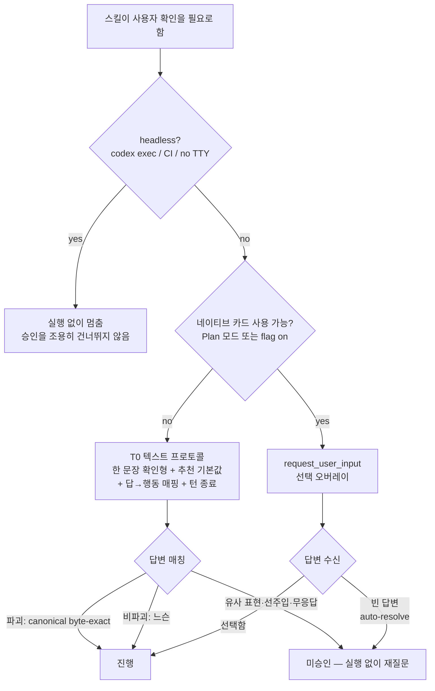
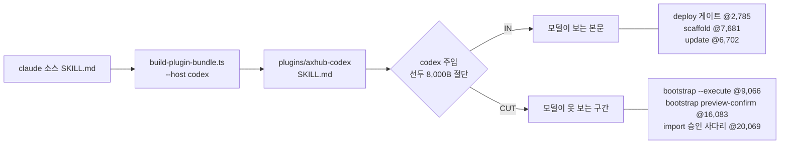

# Codex Interactive UX Parity - Plan

## Goal Capsule

- **Objective:** codex 번들 사용자가 Claude 사용자와 같은 수준으로 axhub 여정을 완주하게 만들어요. 선택 UX 열화(번호 타이핑 강요·질문 후 미대기)를 codex 자체 규격에 맞는 질문 프로토콜로 닫고, 이번 실측이 드러낸 **승인 게이트 8,000B 절단 밖 이탈**이라는 안전 결함과 번들 텍스트 잔여물을 함께 정리해요.
- **Authority hierarchy:** 이 플랜 → 원 연구 문서(`codex-선택UX-연구.md`, `codex-UX-프리미티브-parity.md`) → 선행 플랜(`docs/plans/2026-08-19-001-feat-codex-plugin-compat-plan.md`) → 정책 문서(`docs/policy/`). 충돌 시 구현 방식은 이 플랜의 KTD 가 우선하고, 제품 스코프 변경은 사용자 확인이 필요해요.
- **Stop conditions:** U1 라이브 실측이 KTD1·KTD6 의 전제(플래그로 카드가 뜬다 / 빈 답변이 모델에 돌아온다)를 깨면 U5·U6·U8 을 멈추고 재설계를 보고해요. `~/.codex` 사용자 설정을 쓰지 않아요 — 전 과정 격리 `CODEX_HOME` 읽기·쓰기예요. 어떤 유닛도 사용자 승인 게이트를 약화시키는 방향으로는 진행하지 않아요.
- **Execution profile:** repo 로컬 작업 + 격리 `CODEX_HOME` 검증. codex 실세션은 U1·U9 검증 목적에만 써요.
- **Tail ownership:** Scope Boundaries 의 Deferred 항목(MCP `ask_user` 도구, 미측정 8 카테고리 정밀 매핑, 업스트림 이슈)은 이 플랜의 DoD 밖이에요.

---

## Product Contract

### Summary

두 연구 문서의 권고를 axhub repo 안에서 실행 가능한 범위로 옮겨요. 텍스트 질문 프로토콜을 codex 자체 규격(텍스트 객관식 금지·추천 기본값·Other)에 맞춰 다시 쓰고, 네이티브 선택 카드는 안내되는 opt-in 으로 두되 "빈 답변 = 미승인" 을 정책에 못 박아요. 같은 릴리즈에서 승인 게이트의 8KB 절단 이탈을 닫고 번들 텍스트 잔여물을 기계 강제로 정리해요. Claude 트리 동작은 바뀌지 않아요.

### Problem Frame

codex 번들은 설치·로드·배포까지 도달하지만 사용자가 선택을 요구받는 지점에서 UX 가 무너져요. codex Default 모드에서 `request_user_input` 이 호출 불가라 모델에게 위젯 선택지가 없고, 동시에 codex Default 모드 지침은 *"Never write a multiple choice question as a textual assistant message"* 를 명시해서 지금의 "1) 2) 몇 번?" 출력은 **codex 자체 지침과 충돌하는 상태**예요. 여기에 OpenAI 프롬프팅 가이드의 persistence 편향이 겹쳐 모델이 질문을 뱉고도 기다리지 않아요.

더 위험한 건 UX 가 아니라 안전이에요. codex 는 SKILL.md 본문을 파일 선두 기준 8,000B 에서 절단하는데, **bootstrap 의 승인 게이트 4종과 import 의 승인 계약이 전부 절단선 밖**이에요 (bootstrap 첫 `--execute` @9,066 · preview-confirm @16,083 · import 승인 사다리 @20,069). 지금은 본문 첫 줄의 self-recovery 안내 한 줄이 유일한 대비책이라, 모델이 그 지시를 안 따르는 단 한 세션에서 승인 없는 생성 saga 가 나요. 그리고 번들에는 `AUQ`·`CLAUDE_NON_INTERACTIVE` 같은 미치환 잔여물과, codex 에 존재하지도 않는 도구(`Monitor`·`ScheduleWakeup`·`TaskOutput`) 금지 조항이 남아 그 8KB 예산을 먹고 있어요.

### Requirements

**안전 (최우선)**

- R1. 실행 5스킬(bootstrap·deploy·import·scaffold·update)의 승인 게이트 문자열이 codex 번들에서 각 파일의 첫 8,000B 안에 있어요. 현재 deploy·scaffold·update 는 IN, **bootstrap·import 는 CUT** 이에요.
- R2. 게이트가 절단선 밖으로 나가면 테스트가 red 예요 — recovery-line 존재 assert 가 아니라 게이트 문자열 자체의 byte offset assert 로 강제해요.
- R3. 네이티브 선택 카드가 켜진 세션에서 **빈 답변(auto-resolve)은 미승인**이에요. 실행하지 않고 다시 물어요. 이 규칙은 always-on 훅과 정책 문서가 소유하고, 훅이 신뢰되지 않아 꺼진 세션에서도 살아 있도록 같은 문장을 실행 5스킬 본문 첫 8,000B 안에도 둬요.

**질문 UX**

- R4. codex 판 질문 문안이 codex 규격에 정합해요 — 번호 메뉴를 쓰지 않고, 한 문장 확인형 질문 + 추천 기본값 표기 + 답→행동 매핑 병기 + 질문 뒤 도구 호출 없이 턴 종료예요.
- R5. 답변 매칭이 2-tier 예요 — 비파괴 선택은 느슨하게(숫자·서수·라벨·prefix), 파괴 게이트는 canonical 문구 byte-exact 만이에요 (AP-12 현행 계약 유지).
- R6. 네이티브 선택 카드를 켜는 방법이 온보딩·README codex 판에 한 줄로 안내돼요 (opt-in — 자동 설정하지 않아요).

**번들 정합**

- R7. codex 번들 텍스트 파일에 Claude-host 문자열과 codex 에 존재하지 않는 도구명이 0건이에요 (`AUQ`, `TodoWrite`, `CLAUDE_NON_INTERACTIVE`, `Monitor`·`ScheduleWakeup`·`TaskOutput` 금지 조항 포함).
- R8. `--host claude` 산출물은 이 플랜 전후로 byte 동일해요.

**운영 안내**

- R9. codex 판 deploy 가 장기 대기(`deploy verify --wait`)의 yield 를 실패로 오판하지 않아요 — 폴링 계약이 본문에 있어요.
- R10. 온보딩 codex 판이 첫 실행의 네트워크 host 승인과 훅 신뢰(`/hooks`)를 선제 안내해요.

**검증**

- R11. 기본 승인 정책(`on-request`) 프로파일에서 대표 여정 QA 가 재현 가능해요 — 사용자 `~/.codex` 를 건드리지 않는 격리 `CODEX_HOME` 절차가 문서화돼 있어요.

### Success Criteria

- bootstrap·import 의 승인 게이트가 절단선 안으로 들어오고, 그 사실을 테스트가 지켜요.
- 격리 프로파일 QA 에서 배포 승인 게이트가 사용자 응답 없이 통과되는 경로가 0건이에요.
- codex 번들 grep 잔여물 0건, `plugin:budget:codex` green, claude 번들 byte 불변.
- flag on 세션에서 카드가 뜨고, 2분 방치 시 실행 없이 재질문으로 처리돼요.

### Scope Boundaries

**In scope**
- codex 번들 텍스트·transform·테스트·정책(AP-12)·온보딩 문서
- 격리 프로파일 라이브 QA 절차

**Deferred to Follow-Up Work**
- **MCP `ask_user` 도구** — 오늘 기본으로 동작하는 유일한 네이티브 위젯 경로지만 ax-hub-cli 서버측 구현이 전제라 이 repo 밖이에요. 이 플랜은 인터페이스 요구사항만 기록해요(Open Questions).
- 미측정 8 parity 카테고리 정밀 매핑 (훅 출력 필드 × 이벤트 전수, 세션·컨텍스트 등)
- codex 내장 awaiter 에이전트 위임 실험 (장기 대기의 codex-native 해법 후보)
- 업스트림 요청 2건 (`default_mode_request_user_input` Stable 승격, Default 모드 blocking config)

**Out of scope**
- Claude 트리의 AUQ 계약 변경 — 이 플랜은 codex lane 만 바꿔요.
- codex `~/.codex` 사용자 설정 자동 수정 — 어떤 유닛도 사용자 config 를 쓰지 않아요.
- 승인 팝업·터미널 위젯(fzf/gum)·커스텀 슬래시 우회 — 연구에서 구조적 불가로 배제됐어요.

### Sources

- `codex-선택UX-연구.md` — request_user_input 3층 게이트, MCP elicitation, 배제 경로, 3단 tier 권고
- `codex-UX-프리미티브-parity.md` — 79 프리미티브 매핑, critical/high 격차 5건, 번들 결함 6건
- `docs/plans/2026-08-19-001-feat-codex-plugin-compat-plan.md` — 파생 번들 구조·게이트 스위트 (선행 플랜)
- `docs/policy/agent-policy.md` AP-12 — 진입 확인 통합 게이트와 codex 판 승인 프리미티브

---

## Planning Contract

### Key Technical Decisions

- **KTD1. 텍스트 프로토콜이 기본 lane, 네이티브 카드는 안내되는 opt-in.** (session-settled: user-approved — chosen over 온보딩 적극 권장/자동 설정: `default_mode_request_user_input` 이 UnderDevelopment 이고 켜도 Default 모드에선 non-blocking auto-resolve 함정이 있어 unstable 표면에 완주를 걸 수 없어요.) Governs R4, R6.
- **KTD2. 8KB 대응은 최소 침습.** 게이트 문단을 파일 앞으로 옮기고 세부를 references 로 분리해요 — codex 판 본문 전면 재저작은 하지 않아요. (session-settled: user-approved — chosen over 전면 재저작: 비용 대비 안전 이득이 같아요.) Governs R1.
- **KTD3. MCP elicitation 은 이번 범위 밖.** 인터페이스 요구사항만 기록해요. (session-settled: user-approved — chosen over 크로스-repo 유닛 포함: ax-hub-cli `ask_user` 서버 구현이 전제이고, elicitation 답변은 codex Guardian 모델에서 untrusted 라 AP-12 승인 채널로 부적합해요.)
- **KTD4. 라이브 QA 를 첫 유닛으로 선행.** (session-settled: user-approved — chosen over 문서 작업 선착수: 이 머신 config 가 `never` + full-access 라 현 상태 QA 는 카드도 승인도 안 뜨는 교란 상태예요.) Governs R11.
- **KTD5. 잔여물 제거는 치환 테이블 + FORBIDDEN 이중 강제.** 치환이 제거하고 FORBIDDEN 이 재발을 막아요 — 한쪽만으로는 다음 릴리즈에 되돌아와요. Governs R7.
- **KTD6. fail-closed 규칙은 세 채널이 겹쳐 소유.** "빈 답변 = 미승인" 을 skill 본문에만 두면 8KB 절단에 걸리고, 훅에만 두면 미신뢰 세션에서 조용히 꺼져요 — 두 채널의 실패 모드가 다르니 겹쳐 둬요. AP-13 과 같은 논리로 always-on 훅 문맥에 넣고, AP-12 가 기계 강제하며, 실행 5스킬 본문 첫 8,000B 안에도 같은 문장을 둬요. Governs R3.
- **KTD7. 죽은 도구 금지 조항은 치환으로 제거하되 claude 트리는 유지.** codex 에 없는 `Monitor`·`ScheduleWakeup`·`TaskOutput` 금지 문장은 codex 판에서만 사라져요 — 소스 삭제는 claude lane 계약을 깨요. Governs R7, R8.

### High-Level Technical Design

**질문 라우팅 — 3단 tier 와 fail-closed 경로**

**8,000B 절단선과 게이트 위치 — 현재 상태**

두 다이어그램은 방향이 아니라 현재 실측이에요 — offset 은 `plugins/axhub-codex/skills/*/SKILL.md` 에서 직접 측정한 값이고, U3 의 assert 가 이 값을 계약으로 고정해요.

---

## Implementation Units

### Phase A — 전제 검증

### U1. 격리 프로파일 라이브 QA

- **Goal:** 이 플랜의 설계 전제 4개를 실제 codex 세션에서 확인해요 — 카드가 뜨는가, 빈 답변이 어떻게 돌아오는가, elicitation 이 기본 정책에서 뜨는가, 절단이 실제로 관측되는가.
- **Requirements:** R11. KTD1·KTD4·KTD6 의 전제 검증.
- **Dependencies:** 없음 — 첫 유닛이에요.
- **Files:** `docs/qa/codex-interactive-ux-qa.md` (신규 — 재현 절차와 관측 기록)
- **Approach:**
  1. 격리 `CODEX_HOME` 프로파일을 만들어요 — 사용자 `~/.codex` 를 읽지도 쓰지도 않아요. 승인 정책은 기본값(`on-request`), 샌드박스는 기본값을 써요.
  2. flag off 상태에서 codex 번들을 설치하고 bootstrap·deploy 질문 지점을 관측해요 — 무엇이 화면에 뜨는지, 모델이 기다리는지.
  3. `-c features.default_mode_request_user_input=true` 로 같은 여정을 반복해요 — 카드 렌더 여부, 카드 호출 뒤 모델에게 제어권이 언제 돌아오는지(답변 시점인지 즉시인지), 2분 방치 시 모델에게 돌아오는 값, 그 뒤 모델의 행동.
  4. 8,000B 절단을 세션에서 직접 확인해요 — bootstrap 본문의 절단 위치 문자열이 모델 컨텍스트에 없는지.
  5. 관측 결과를 QA 문서에 기록하고, 전제가 깨진 항목은 즉시 보고해요.
- **Execution note:** 관측 기록이 산출물이에요 — 코드 변경 없이 끝나요. 전제가 깨지면 U5·U6 착수 전에 재설계를 보고해요.
- **Patterns to follow:** 선행 플랜 U1 의 격리 세션 스모크 절차.
- **Test scenarios:**
  - flag off 세션에서 배포 승인 질문이 화면에 뜨고 모델이 답을 기다려요.
  - flag on 세션에서 선택 오버레이가 뜨고 방향키 선택이 동작해요.
  - flag on 세션에서 2분 방치하면 모델이 빈 답변을 받고, 그 뒤 무엇을 하는지 기록돼요.
  - flag on 세션에서 카드를 Esc 로 취소하면 모델이 받는 값과 이후 행동이 기록돼요.
  - 카드가 열려 있는 동안 모델이 다음 도구를 호출하는지 기록돼요.
  - 사용자 `~/.codex/config.toml` 이 QA 전후로 byte 동일해요.
- **Verification:** QA 문서에 4개 관측이 기록되고, 각 항목이 이 플랜의 전제와 일치하거나 불일치가 명시돼요.

---

### Phase B — 번들 정합 (P0)

### U2. 번들 텍스트 잔여물 정리

- **Goal:** codex 번들에서 Claude-host 문자열과 존재하지 않는 도구명을 제거하고, 재발을 기계로 막아요.
- **Requirements:** R7, R8. KTD5·KTD7 구현.
- **Dependencies:** 없음 — U1 과 병행 가능해요.
- **Files:** `scripts/build-plugin-bundle.ts` (CODEX_SUBSTITUTIONS), `tests/codex-bundle.test.ts` (FORBIDDEN_STRINGS), `plugins/axhub-codex/**` (재생성 산출물)
- **Approach:**
  1. 치환 테이블에 항목을 더해요 — `AUQ` → `명시 텍스트 승인`, `TodoWrite` → `update_plan`, `CLAUDE_NON_INTERACTIVE` 를 포함한 headless 판정 구문. longest-first 정렬 계약을 유지해요.
  2. codex 에 존재하지 않는 도구 금지 조항(`Monitor`·`ScheduleWakeup`·`TaskOutput` 을 지목하는 문장)은 문장 단위 치환으로 codex 판에서만 제거해요 — 소스는 그대로 둬요.
  3. FORBIDDEN_STRINGS 에 제거된 토큰을 등록해 다음 릴리즈의 재유입을 red 로 잡아요.
  4. `plugin:bundle:all` 재생성 후 claude 트리 byte 동일을 확인해요.
- **Patterns to follow:** 기존 `CODEX_SUBSTITUTIONS` 항목과 `codex bundle has no forbidden host strings` 테스트.
- **Test scenarios:**
  - codex 번들 전 텍스트 파일에 `AUQ`·`TodoWrite`·`CLAUDE_NON_INTERACTIVE` 가 0건이에요.
  - codex 번들에 `Monitor`·`ScheduleWakeup`·`TaskOutput` 금지 조항이 0건이고, claude 번들에는 그대로 남아 있어요.
  - 치환 테이블이 여전히 longest-first 정렬이에요 (역순 입력 시 red).
  - 제거 대상 문장이 소스에서 변형되면 치환이 miss 되고 FORBIDDEN 이 red 로 잡아요 — 조용한 재유입이 없어요.
  - `--host claude` 산출물이 변경 전 번들과 byte 동일해요.
- **Verification:** `bun run plugin:bundle:all` 후 grep 0건, `bun test tests/codex-bundle.test.ts` green, `bun run plugin:budget:codex` green.

---

### Phase C — 안전 게이트 (P0)

### U3. 게이트 byte-offset assert 신설

- **Goal:** 승인 게이트가 절단선 밖으로 나가면 CI 가 red 가 되게 만들어요.
- **Requirements:** R2. KTD2 의 강제 장치.
- **Dependencies:** U2 (치환 후 문자열이 확정돼야 assert 대상이 안정돼요).
- **Files:** `tests/codex-bundle.test.ts`
- **Approach:**
  1. 실행 5스킬별로 "반드시 첫 8,000B 안에 있어야 하는 게이트 문자열" 목록을 테이블로 선언해요 — bootstrap 4종(템플릿 선택·앱 이름·preview-confirm·첫 `--execute`), deploy 통합 게이트, import 승인 사다리, scaffold 진입 게이트, update apply 실행 지시, 그리고 5스킬 공통의 fail-closed 문장(KTD6).
  2. 각 문자열의 byte offset 을 파일 선두 기준으로 측정하고 8,000 미만을 assert 해요. 절단 기준이 frontmatter 포함 파일 전체라는 실측을 주석으로 남겨요.
  3. 이 시점에서 bootstrap·import 는 **의도적으로 red** 예요 — U4 가 green 으로 만들어요.
- **Execution note:** test-first 로 진행해요 — assert 를 먼저 red 로 만들고 U4 가 통과시켜요. 이 repo 의 문서-계약 테스트 문화예요.
- **Patterns to follow:** 기존 `approval ladder carries the pre-injection-invalid clause` 테스트의 스킬별 순회 구조.
- **Test scenarios:**
  - deploy·scaffold·update 의 게이트 문자열이 8,000B 안이에요 (현재 상태로 green).
  - bootstrap·import 의 게이트 문자열이 8,000B 밖이에요 (U4 전 red, U4 후 green).
  - 게이트 문자열이 파일에 아예 없으면 offset 미검출로 red 예요 — 삭제도 잡아요.
- **Verification:** U4 전 red 2건, U4 후 전체 green.

### U4. bootstrap·import codex 코어 재배치

- **Goal:** bootstrap·import 의 승인 게이트를 codex 판에서 첫 8,000B 안으로 옮겨요.
- **Requirements:** R1. KTD2 구현.
- **Dependencies:** U1 (절단 관측 확인), U3 (red assert 존재).
- **Files:** `codex-overrides/skills/bootstrap/SKILL.md` (신규), `codex-overrides/skills/import/SKILL.md` (신규), 필요 시 각 skill 의 `references/` 분리 파일
- **Approach:**
  1. bootstrap codex 판을 저작해요 — 템플릿 선택·앱 이름 확인·preview-confirm·`--execute` 금지 조항을 본문 앞쪽으로 올리고, 배경 설명·에러 카탈로그·resume 세부를 references 로 내려요.
  2. import codex 판도 같은 방식으로 — 진입 겸용 승인 문장과 canonical 승인 문구·승인 사다리를 앞으로 모아요.
  3. 두 파일 모두 codex per-skill 예산(35,000B) 안을 유지하고, 첫 줄 self-recovery 안내는 보조 수단으로 남겨요.
  4. `SOURCE_HASHES.json` 을 갱신해 override 가 소스 드리프트를 감지하게 해요.
- **Execution note:** 문안을 새로 쓰지 말고 **옮겨요** — 승인 문구·질문 텍스트는 byte 그대로 보존해야 AP-12 parity 테스트와 기존 계약이 유지돼요.
- **Patterns to follow:** `codex-overrides/skills/update/SKILL.md` 의 override 저작 방식과 references 분리.
- **Test scenarios:**
  - U3 의 byte-offset assert 가 bootstrap·import 에서 green 이에요.
  - 두 스킬의 승인 질문 문자열이 소스와 byte 동일해요 (문안 변형 없음).
  - 각 codex SKILL.md 가 35,000B 이하이고 총 예산이 210,000B 이하예요.
  - `SOURCE_HASHES.json` pin 이 현재 소스와 일치해요.
- **Verification:** `bun test tests/codex-bundle.test.ts` 전체 green, `bun run plugin:budget:codex` green.

---

### Phase D — 질문 프로토콜 (P1)

### U5. codex 질문 프로토콜 저작

- **Goal:** codex 판 질문 문안을 codex 자체 규격에 맞게 다시 써요 — 번호 메뉴를 없애고 대기를 강제해요.
- **Requirements:** R4, R5. KTD1 구현.
- **Dependencies:** U1 (모델 실제 행동 관측), U4 (override 저작 기반).
- **Files:** `codex-overrides/hooks/context/` (질문 프로토콜 문맥 신규), `codex-overrides/skills/{bootstrap,import}/SKILL.md`, `scripts/build-plugin-bundle.ts` (승인 사다리 치환 문구 갱신)
- **Approach:**
  1. 5요소를 문안으로 확정해요 — (a) 질문 뒤 도구 호출 없이 턴 종료, (b) 한 문장 확인형 질문 + 추천 기본값을 첫 선택지로 두고 `(추천)` 접미, (c) 답→행동 매핑을 질문 메시지 안에 병기, (d) 2-tier 답변 매칭(비파괴 느슨 / 파괴 canonical byte-exact), (e) CLI dry-run → `--execute` 2단 백스톱 유지.
  2. 이 5요소를 **always-on 훅 문맥**에 넣어요 — skill 8KB 절단과 무관하게 모든 codex 세션에 주입돼요 (KTD6 과 같은 배치 논리).
  3. skill 본문의 승인 문단은 훅과 중복 서술하지 않고 게이트 문구만 유지해요 — byte 예산을 아껴요.
  4. 번호 메뉴 금지를 명시해요 — codex Default 모드 지침과 정합하는 방향이에요.
- **Execution note:** U1 에서 모델이 텍스트 질문 뒤 실제로 기다렸는지 관측한 결과를 반영해요. 안 기다렸다면 (a) 문안을 강화하고 재관측해요.
- **Patterns to follow:** `codex-overrides/hooks/context/update-first.md` 의 문맥 문안 스타일, AP-13 의 always-on 훅 배치.
- **Test scenarios:**
  - always-on 훅 payload 에 5요소가 모두 있고 노출 예산 안이에요.
  - codex 번들 본문에 번호 메뉴 형태의 선택지 지시가 0건이에요.
  - 파괴 게이트의 canonical 승인 문구와 선주입 무효 조항이 그대로 살아 있어요 (AP-12 parity green).
  - `--host claude` 산출물 byte 불변이에요.
- **Verification:** `bun test` 전체 green, `bun run lint:tone --strict` 0 err.

### U6. AP-12 정책 갱신

- **Goal:** "네이티브 카드가 켜져 있으면 그것으로 묻되, 빈 답변은 미승인" 을 정책 본체에 넣고 기계 강제해요.
- **Requirements:** R3. KTD6 구현.
- **Dependencies:** U1 (auto-resolve 실동작 확인), U5 (훅 문안 확정).
- **Files:** `docs/policy/agent-policy.md` (AP-12), `CLAUDE.md`, `codex-overrides/POLICY.md`, `POLICY.md`, `tests/policy-parity.test.ts` (invariant 갱신), `codex-overrides/skills/{bootstrap,deploy,import,scaffold,update}/SKILL.md` (fail-closed 문장 삽입)
- **Approach:**
  1. AP-12 의 codex 판 프리미티브 절에 카드 우선순위와 fail-closed 규칙을 추가해요 — 텍스트 승인 1회는 기본 lane 으로 유지하고, 카드가 있으면 카드가 우선이며, 빈 답변은 승인이 아니에요.
  2. `- invariant(codex):` 에 새 문구를 등록해 parity 테스트가 codex 파생 파일에서 강제하게 해요.
  3. `CLAUDE.md` 의 AP-12 요약과 `POLICY.md` 사용자 공개 문안을 같은 방향으로 갱신해요.
  4. 같은 fail-closed 문장을 실행 5스킬 codex 판 본문 첫 8,000B 안에 넣어요 — 훅이 꺼진 세션의 백스톱이에요. 문장은 카드가 열려 있는 동안 실행 단계로 넘어가지 않는다는 조항을 포함해요(답변이나 취소를 받은 뒤에만 진행).
- **Patterns to follow:** AP-13 의 host 별 계약 서술과 `invariant(codex)` 문법.
- **Test scenarios:**
  - `tests/policy-parity.test.ts` 가 새 invariant 를 codex 파생 4스킬에서 찾아요.
  - AP-12 요약이 정책 본체와 어긋나지 않아요 (`tests/policy-parity.test.ts` 의 CLAUDE.md parity).
  - 해요체 tone 게이트 0 err.
- **Verification:** `bun test tests/policy-parity.test.ts` green, `bun run lint:tone --strict` green.

---

### Phase E — 운영 안내 (P1)

### U7. 장기 대기 폴링 계약

- **Goal:** codex 판 deploy 가 `verify --wait` 의 yield 를 실패로 오판하지 않게 해요.
- **Requirements:** R9.
- **Dependencies:** U4 (codex override 저작 기반).
- **Files:** `codex-overrides/skills/deploy/SKILL.md` 또는 그 references
- **Approach:**
  1. codex 는 장기 명령을 최대 30초에 yield 하고 백그라운드 터미널로 넘긴다는 사실을 명시해요 — yield 는 실패도 완료도 아니에요.
  2. 폴링 계약을 써요 — 빈 입력 폴링으로 완주를 기다리고, 같은 deployment 에 대해 verify 를 중복 실행하지 않아요.
  3. 성공 선언 규칙(`deploy verify` 1회, static 은 `active_release_id`)은 그대로 유지해요 — 폴링은 대기 방식만 바꿔요.
- **Execution note:** 이 계약은 U1 QA 에서 실제 yield 동작을 관측한 뒤 문안을 확정해요.
- **Patterns to follow:** 기존 deploy SKILL 의 성공 선언 규칙 서술 방식.
- **Test scenarios:**
  - codex 판 deploy 본문에 폴링 계약 문자열이 있고 8,000B 안이에요.
  - 성공 선언 규칙 문자열이 소스와 동일하게 유지돼요.
  - claude 판 deploy 는 변경되지 않아요.
- **Verification:** `bun test tests/codex-bundle.test.ts` green, U9 QA 에서 배포 1회 완주.

### U8. 온보딩·README codex 판 안내

- **Goal:** 비개발자가 첫 세션에서 막히는 3지점을 선제 안내해요 — 네트워크 승인, 훅 신뢰, 선택 카드 opt-in.
- **Requirements:** R6, R10. KTD1 의 사용자 표면.
- **Dependencies:** U1 (실제 첫 세션 마찰 관측), U6 (fail-closed 규칙 확정).
- **Files:** `codex-overrides/skills/onboarding/SKILL.md` 또는 references, `codex-overrides/README.md`
- **Approach:**
  1. 첫 axhub 명령에서 네트워크 host 승인이 한 번 요구된다는 것과, 허용해야 백엔드에 닿는다는 것을 안내해요.
  2. 훅 신뢰 팝업에서 신뢰하지 않으면 자동 업데이트·라우팅 가드가 조용히 꺼진다는 것과 `/hooks` 로 언제든 되돌릴 수 있다는 것을 안내해요.
  3. 선택 카드 opt-in 을 한 줄 config 로 안내해요 — 자동으로 설정하지 않고, 켠 경우 빈 답변이 미승인으로 처리된다는 것도 함께 알려요.
- **Patterns to follow:** `codex-overrides/README.md` 의 현행 안내 톤.
- **Test scenarios:**
  - onboarding codex 판에 3지점 안내가 있고 tone 게이트를 통과해요.
  - 안내가 사용자 config 를 자동 수정하라고 지시하지 않아요 (금지 문구 검사).
  - codex per-skill 예산 안이에요.
- **Verification:** `bun run lint:tone --strict` green, `bun run plugin:budget:codex` green.

---

### Phase F — 마감

### U9. 회귀·QA·릴리즈

- **Goal:** 전체 게이트를 통과시키고 대표 여정을 기본 정책 프로파일에서 완주해요.
- **Requirements:** R1~R11 전체 확인.
- **Dependencies:** U2, U3, U4, U5, U6, U7, U8.
- **Files:** `CHANGELOG.md` (릴리즈 narrative), `docs/qa/codex-interactive-ux-qa.md` (QA 결과 갱신)
- **Approach:**
  1. 전 게이트 실행 — `bun test`, `bun run lint:tone --strict`, `bun run plugin:bundle:all`, `bun run plugin:budget`, `bun run plugin:budget:codex`, `bun run typecheck`.
  2. 격리 프로파일에서 대표 여정 QA — 첫 셋업 → 앱 생성(승인 게이트 관측) → 배포(장기 대기 관측) → 상태 확인. flag off / on 두 번 돌려요.
  3. 승인 게이트가 사용자 응답 없이 통과되는 경로가 0건임을 확인해요 — 하나라도 있으면 릴리즈를 멈춰요.
  4. 릴리즈 flow 3단계(`bun run release` → CHANGELOG narrative amend → `bun run release:tag`).
- **Execution note:** QA 실패 시 codex 노출을 늘리지 않고 원인을 후속 유닛으로 등록해요 — 안전 게이트 회귀는 릴리즈 blocker 예요.
- **Patterns to follow:** 선행 플랜 U10 의 파괴 경로 QA 와 릴리즈 절차.
- **Test scenarios:**
  - 전 게이트 green.
  - flag off 여정에서 승인 게이트 무응답 통과 0건.
  - flag on 여정에서 2분 방치 후 실행 없이 재질문 1건 이상 관측.
  - 사용자 `~/.codex` byte 불변.
- **Verification:** QA 문서에 두 여정 결과가 기록되고, 태그가 생성돼요.

---

## Verification Contract

- `bun test` — codex-bundle 게이트(byte-offset assert 포함), policy-parity, 기존 스위트 전체 green
- `bun run lint:tone --strict` — 0 err
- `bun run plugin:bundle:all` — claude 트리 byte 불변, codex 트리 재생성 일치
- `bun run plugin:budget` / `plugin:budget:codex` — 총량·per-skill 예산 green
- `bun run typecheck` — 0 err
- 격리 프로파일 대표 여정 QA — flag off / on 두 경로에서 승인 게이트 무응답 통과 0건

## Definition of Done

1. bootstrap·import 승인 게이트가 codex 번들 첫 8,000B 안에 있고, byte-offset assert 가 이를 강제해요.
2. codex 번들에 Claude-host 문자열·존재하지 않는 도구명 잔여물이 0건이에요.
3. codex 질문 프로토콜 5요소가 always-on 훅으로 모든 세션에 주입돼요.
4. AP-12 가 "빈 답변 = 미승인" 을 담고 parity 테스트가 강제해요.
5. 온보딩 codex 판이 네트워크 승인·훅 신뢰·카드 opt-in 을 안내해요.
6. Verification Contract 전 항목 green + 대표 여정 QA 두 경로 완주 기록.

## Open Questions

- **MCP `ask_user` 인터페이스** — deferred 이지만 인터페이스 요구사항은 지금 기록해요: single-select enum(titled oneOf) + string 만 사용, number·multi-select 금지, 빈 스키마 금지(자동 수락), Decline 수신 시 텍스트 폴백. ax-hub-cli 쪽 착수 시 이 제약을 전제로 설계해요.
- **최소 codex 버전** — elicitation custom-server 지원은 2026-04-08 이후 릴리스에만 있어요. 정확한 릴리스 번호 매핑이 미확정이라 T2 착수 시 확인이 필요해요.
- **Codex 데스크톱 앱의 폼 수용력** — `openai/standard-form-input` 선언 여부가 클로즈드소스라 미확인이에요. 선언한다면 데스크톱 사용자는 full-access 에서도 폼을 볼 수 있어요.
- **U1 이 전제를 깨는 경우** — flag on 에서도 카드가 안 뜨거나 빈 답변이 관측되지 않으면 KTD1 의 opt-in 안내(U8)와 U6 의 fail-closed 문안을 재설계해요.
- **U4 의 실제 이동량이 KTD2 와 긴장해요** — bootstrap 은 ~8KB, import 는 ~12KB 를 앞으로 재배치해야 게이트가 절단선 안으로 들어와요. 스킬별 byte 목표를 U4 착수 시 정할지, 아니면 KTD2 의 "최소 침습" 을 재확인할지 미정이에요.
- **always-on 훅 증량의 노이즈 비용** — codex 는 `additionalContext` 를 매 세션 "hook context" 로 노출해요. 질문 프로토콜 5요소를 훅에 넣으면 사용자가 매 세션 그 텍스트를 봐요. 노출 예산 안이더라도 체감 노이즈가 수용 가능한지 U1 QA 에서 함께 판단해요.
- **2-릴리즈 분할 여부** — 안전 유닛(U2·U3·U4)만 먼저 내보내면 위험 감소가 며칠 빨라져요. 대신 릴리즈가 두 번이고 QA 도 두 번이에요. 현재 DoD 는 단일 릴리즈 전제예요.

## Risks & Dependencies

- **R-1. `default_mode_request_user_input` 이 UnderDevelopment 라 예고 없이 바뀔 수 있어요.** 완화: 텍스트 프로토콜이 기본 lane 이라 flag 가 사라져도 완주가 유지돼요 (KTD1).
- **R-2. U4 의 문단 이동이 문안을 변형하면 AP-12 parity 와 기존 계약이 깨져요.** 완화: 옮기되 byte 보존, parity 테스트가 강제.
- **R-3. 훅 문맥이 커지면 additionalContext 노출 예산을 넘어요.** 완화: U5 에서 skill 본문 중복 서술을 제거해 총량을 상쇄하고, 기존 노출 예산 테스트가 강제해요.
- **R-4. QA 가 사용자 `~/.codex` 를 오염시킬 위험.** 완화: 격리 `CODEX_HOME` 강제 + 전후 byte 비교를 test scenario 로 고정.
- **의존:** codex-cli 0.148.0 기준 실측이에요. QA 시점에 버전이 오르면 U1 관측을 먼저 갱신해요.
