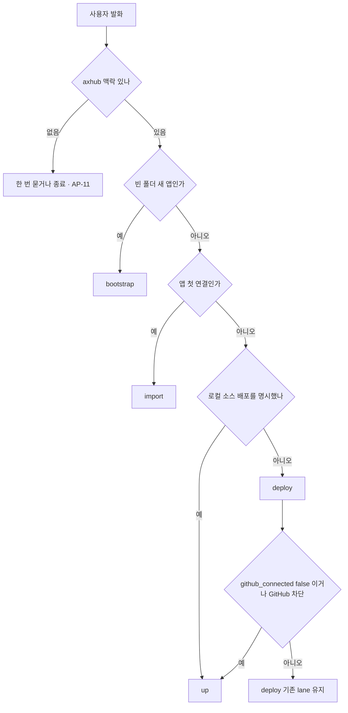
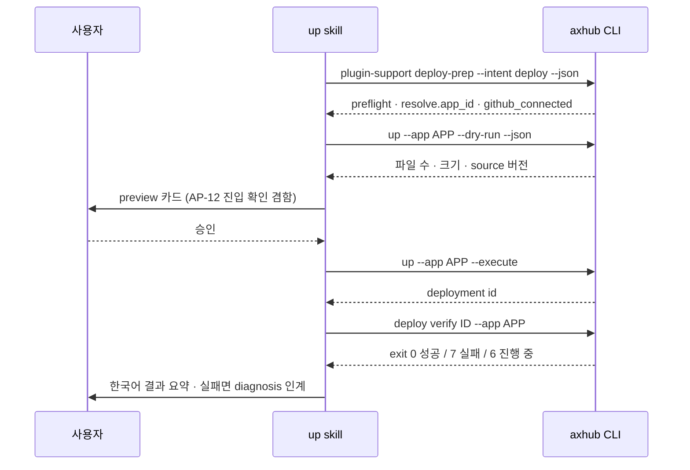

# Local Source Deploy Skill (axhub up) - Plan

**Target repo:** 이 저장소(axhub plugin). `ax-hub-cli:` 접두사가 붙은 경로는 읽기 전용 참조이고 이 플랜은 그 저장소를 고치지 않아요.

## Goal Capsule

- **Objective:** axhub 사용자가 GitHub 저장소 없이 지금 폴더를 그대로 올려 배포해 달라고 말하면, 커밋 상태와 무관하게 한 번의 흐름으로 배포가 끝나고 접근 가능한 URL 까지 확인돼요.
- **Means:** 로컬 소스 배포를 소유하는 11번째 공개 skill `up` 을 추가해요 (KTD1, KD1).
- **Authority hierarchy:** `docs/policy/agent-policy.md` · `docs/policy/dev-policy.md` → 이 플랜의 KTD → `CLAUDE.md`. 정책과 충돌하면 정책이 이겨요. 제품 스코프 변경은 사용자 확인이 필요해요.
- **Stop conditions:** `bun run plugin:budget` 이 실패하면 본문을 더 늘리지 않고 멈춰 보고해요 — 먼저 무는 것은 총합 게이트(236,000B, 11개 실측 합계 234,847B)이고 per-skill 35,000B 는 그다음이에요. 두 게이트 모두에 걸려요. codex drift 게이트(`tests/codex-bundle.test.ts`)가 실패하면 파생 번들을 손으로 고치지 않고 소스·override 를 고쳐 재생성해요 (AP-20). `ax-hub-cli` 를 고쳐야 풀리는 항목이 나오면 그 항목을 멈추고 Deferred 로 보고해요.
- **Execution profile:** 문서·skill 본문·테스트 계약 변경이에요. 실제 배포를 실행하는 검증은 하지 않아요.
- **Tail ownership:** Scope Boundaries 의 Deferred 항목(전용 `plugin-support` 헬퍼, `up` 전용 preflight capability)은 이 플랜의 DoD 밖이에요.

---

## Product Contract

### Summary

`axhub up` 을 CLI 내부 분기에서 공개 skill 로 올려요. 새 skill `up` 이 로컬 소스 배포의 preflight · preview · 승인 · 실행 · verify · 진단 인계를 소유하고, `deploy` 와 `bootstrap` 은 라우팅과 mid-flow 분기를 `up` 에 넘겨요. preflight 는 커밋 상태를 게이트로 쓰지 않아요 — 그것이 이 lane 의 정상 입력이에요.

### Problem Frame

`axhub up` 은 CLI 0.29.0 부터 GitHub 없이 로컬 폴더를 올려 배포해요. 그런데 plugin 에서는 사용자가 부를 진입점이 없어요 — `deploy` 의 Upload lane 과 `bootstrap` 의 GitHub 차단 폴백 안에만 있고, 둘 다 다른 이유로 그 지점까지 왔을 때만 열려요.

그 결과 정확히 이 lane 이 존재하는 상황에서 막혀요. `deploy` 의 첫 명령 `plugin-support deploy-preview-summary` 는 작업 트리가 dirty 하면 exit 64 로 끊어요 (`ax-hub-cli:axhub/src/commands/plugin_support/deploy_preview_summary.rs`). git 저장소가 아예 없으면 이 검사가 false 라 통과하지만, **로컬 git 저장소는 있고 GitHub 만 연결되지 않은 앱**이 커밋하지 않은 변경을 들고 있으면 Upload lane 에 닿기 전에 멈춰요. `up` 은 커밋을 보내지 않고 작업 트리를 그대로 올리는데도요.

사용자 쪽 증상은 단순해요: "GitHub 없이 이 폴더 그대로 올려줘" 라고 말할 곳이 없고, `deploy` 로 우회하면 커밋하라는 안내를 받아요.

**이 플랜이 고치는 범위는 명시 발화 경로예요.** 사용자가 로컬 소스 배포를 말로 지목하면 새 skill 이 받아 끝까지 배포해요. 반대로 같은 사용자가 그냥 "배포해" 라고만 하면 라우팅은 여전히 `deploy` 로 가고, 커밋 게이트가 `deploy-prep` 보다 먼저라 인계 지점에 닿지 못해요 — 그 경로는 `deploy-preview-summary` 의 순서를 바꿔야 열리는데 그 명령은 `ax-hub-cli` 소유라 KD3 의 범위 밖이에요.

### Key Decisions

- KD1. **새 skill 이 로컬 소스 배포를 소유하고 deploy·bootstrap 이 양보해요** (session-settled: user-approved — chosen over deploy 안의 lane 으로 유지: 사용자 직접 진입점이 없다는 것이 이번 작업의 이유예요). Governs R1, R3.
- KD2. **skill 이름은 `up`, 트리거는 "GitHub 없이 배포" 계열과 "이 폴더 그대로 올려줘" 계열을 함께 받아요** (session-settled: user-approved — chosen over "GitHub 없이" 전용 좁은 트리거: 저장소 없는 앱의 평시 배포도 같은 lane 이에요). Governs R1.
- KD3. **이 저장소만 고치고 `ax-hub-cli` 는 건드리지 않아요** (session-settled: user-approved — chosen over 전용 `plugin-support up-preview-summary` 헬퍼 추가: 두 저장소 동시 릴리즈를 피해요). Governs R5, R6.
- KD4. **`dev-policy.md` 의 skill 수 표기 드리프트를 같은 변경에서 정정해요** (session-settled: user-approved — chosen over 새 항목만 추가: 이미 9개·8개로 어긋나 있어 새 항목만 더하면 드리프트가 굳어요). Governs R15.

### Requirements

**라우팅**

- R1. `up` 은 사용자가 로컬 소스 배포를 명시한 발화에서 진입해요 — "GitHub 없이 배포해", "저장소 없이 배포", "이 폴더 그대로 올려줘", "소스 올려서 배포해".
- R2. AP-11 을 따라 axhub 맥락(대화의 axhub 언급·현재 폴더의 axhub 연결·직전 axhub 작업)이 없으면 진입하지 않고 한 번 묻거나 종료해요. headless 는 묻지 않고 멈춰요.
- R3. `deploy` 와 `bootstrap` 은 R1 유형 발화를 `up` 으로 양보하고, `deploy` 의 mid-flow Upload lane 은 preview·승인 전에 `up` 으로 인계해요.
- R4. `up` 은 빈 폴더 새 앱 생성을 `bootstrap`, 앱 첫 연결을 `import`, 버전 업데이트를 `update`, 배포 실패 원인 진단을 `diagnosis` 로 양보해요.

**실행 계약**

- R5. preflight 는 커밋 상태를 게이트로 쓰지 않아요 — 커밋하지 않은 변경이 있어도 진행해요.
- R6. preview 는 실제로 올라갈 내용을 보여줘요 — 파일 수, 압축 크기, source 버전.
- R7. interactive 에서는 preview 카드 하나가 AP-12 진입 확인을 겸하고, 승인 없이 `--execute` 를 실행하지 않아요. headless 는 dry-run 에서 멈춰요.
- R8. 성공 선언은 AP-1 대로 바인딩된 deployment id 로 `axhub deploy verify <id> --app <app>` 을 실행해서만 해요.
- R9. CLI 0.29.0 미만이면 멈추고 `update` 로 보내며 `deploy create` 로 대체하지 않아요.
- R10. 연결된 저장소를 건드리거나 끊지 않고, 커밋을 만들거나 push 하지 않아요.
- R11. verify 가 terminal failure 를 주면 재배포·롤백을 실행하지 않고 `diagnosis` 로 읽기 전용 인계해요.

**등록과 게이트**

- R12. 공개 skill 수와 skill 목록 문자열이 그것을 담은 모든 표면에서 일치해요 — `.claude-plugin/plugin.json`, `.claude-plugin/marketplace.json`, `.agents/plugins/marketplace.json`, `package.json`, `README.md`, `AGENTS.md`, `CLAUDE.md`, `codex-overrides/README.md`, 그리고 문자열을 검사하는 테스트. `POLICY.md` 는 개수 표기를 담지 않아요 — 행동 문장만 더해요.
- R13. 컨텍스트 총 예산은 11번째 skill 을 반영해 상향하고 per-skill 35,000B 게이트는 그대로 유지해요.
- R14. codex 파생 번들은 소스에서 재생성되고 drift·FORBIDDEN 게이트를 통과해요.
- R15. 정책 문서가 새 skill 과 그 invariant 를 반영하고 parity 테스트를 통과해요.

### Acceptance Examples

- AE1. **커밋하지 않은 변경 + 저장소 미연결 앱**
  - **Covers:** R5
  - **Given:** 로컬 git 저장소가 있고 dirty 하며 `github_connected` 이 false 인 앱 폴더.
  - **When:** 사용자가 "GitHub 없이 이 폴더 그대로 올려줘" 라고 말해요.
  - **Then:** `up` 이 preview 카드를 보여주고, 승인 뒤 배포하고, verify 로 성공을 선언해요. 커밋 안내로 멈추지 않아요.
- AE2. **구 CLI**
  - **Covers:** R9
  - **Given:** CLI 0.28.x.
  - **When:** `up` 이 로컬 소스 배포를 시작해요.
  - **Then:** unknown command 를 확인하고 `update` 안내 뒤 멈춰요. `deploy create` 로 대체하지 않아요.
- AE3. **headless**
  - **Covers:** R7
  - **Given:** 승인 채널이 없는 실행 환경.
  - **When:** 로컬 소스 배포 요청이 들어와요.
  - **Then:** dry-run preview 까지만 하고 `--execute` 를 실행하지 않아요. 선택지를 띄우고 멈추지도 않아요.
- AE4. **axhub 맥락 없음**
  - **Covers:** R2
  - **Given:** axhub 언급도, 폴더의 axhub 연결도, 직전 axhub 작업도 없는 세션.
  - **When:** 사용자가 "이 폴더 올려줘" 라고 말해요.
  - **Then:** interactive 는 axhub 사용 의사를 한 번만 묻고, 아니면 종료해요. 다른 axhub 스킬로 넘기지 않아요.

### Scope Boundaries

**이 플랜이 다루는 것**

- 새 공개 skill `up` 의 본문·frontmatter·references.
- `deploy`·`bootstrap` 의 라우팅 양보와 Upload lane 인계.
- 등록 표면(manifest·README·POLICY·CLAUDE.md), 컨텍스트 예산, 테스트 계약, 정책 문서, codex 파생 번들.

**Deferred to Follow-Up Work**

- `ax-hub-cli` 에 전용 `plugin-support up-preview-summary` 헬퍼 추가 — 판정 로직을 CLI 에 두라는 DP-1 의 방향과 맞지만 이번 범위는 plugin-only 예요 (KD3).
- `preflight` 의 `capabilities` 에 `up` 능력 플래그 추가 — 지금은 unknown-command 감지로 대체해요 (R9).
- `up` 전용 라우팅 회귀 fixture 를 넘어서는 실배포 e2e.
- 명시 발화 없이 `deploy` 로 들어온 dirty · `github_connected` false 앱 — `deploy-preview-summary` 의 커밋 게이트가 `deploy-prep` 보다 먼저라 인계 지점에 닿지 못해요. 그 명령은 `ax-hub-cli` 소유라 KD3 범위 밖이고, `deploy` 의 첫 명령 순서를 바꾸는 대안은 진입 계약 회귀 위험이 커서 별도 결정으로 남겨요.

**이 제품의 정체성 밖**

- `axhub up` 자체의 CLI 동작 변경 — 패킹 규칙, source 해시 산식, 업로드 상한, 제외 목록.
- 저장소 없는 앱에 GitHub 을 연결하는 흐름 — `import` 와 `clarity` 소관이에요.

---

## Planning Contract

### Key Technical Decisions

- KTD1. **preflight 는 `axhub plugin-support deploy-prep --intent deploy --json` 을 직접 호출해요.** `deploy-preview-summary` 는 dirty 작업 트리에 exit 64 를 주는데 그것이 이 lane 의 정상 입력이에요. `deploy-prep` 은 같은 envelope(`preflight.auth_ok`, `preflight.cli_too_old`, `resolve.app_id`, `github_connected`, `in_flight_deploy`, `bootstrap_plan`)을 커밋 게이트 없이 줘요. (session-settled: user-approved — chosen over 전용 CLI 헬퍼: KD3 의 plugin-only 범위) Governs R5, R6.
- KTD2. **preview 데이터는 `axhub up --app <id> --dry-run --json` 에서 얻어요.** dry-run 은 앱 resolve·인증·네트워크 이전에 패킹만 하고 파일 수·크기·source 버전을 돌려줘서 카드가 싸고 오프라인에서도 정확해요.
- KTD3. **`deploy` 의 Upload lane 은 preview·승인 전에 `up` 으로 인계해요.** 그 시점에 아직 mutation 이 없어서 인계가 안전하고, 기존 `deploy` → `diagnosis` 인계와 같은 모양이라 새 패턴을 만들지 않아요. Governs R3.
- KTD4. **`--app` 을 언제나 명시해요.** CLI 의 `required_app` 이 누락 시 exit 64 로 끊어요 (`ax-hub-cli:axhub/src/commands/deploy/mod.rs`). 컨텍스트 앱에 기대지 않아요.
- KTD5. **실행 경로 지시는 각 skill 본문에 두고 skill 간 공유 reference 를 만들지 않아요.** reference 는 plugin cache 라 workspace 밖이고 Desktop 이 권한 프롬프트를 띄우는데 우리 규칙은 그 프롬프트를 생략하라고 해서 조용히 안 읽혀요 — `scripts/check-plugin-context-budget.ts` 주석에 기록된 기존 사고 근거예요. Governs R13.
- KTD6. **컨텍스트 총 예산을 220,000 → 236,000B 로 올려요.** 상한은 선례 추종도 동급 skill 크기 역산도 아니고 실측에서 잡아요 — 11개 합산에 9·10번째가 유지하던 수준의 여유(약 5,000B)를 더한 값이에요. 게이트 감도를 종전과 같게 두는 것이 목적이라, `up` 이 나중에 `deploy` 급으로 자라면 그때 다시 올려요. per-skill 35,000B 게이트는 유지하지만 먼저 무는 것은 총합 게이트예요. Governs R13.
- KTD7. **`up` 은 기존 AP-1·AP-7·AP-11·AP-12·AP-16·AP-17 의 적용 목록에 들어가요.** 이 skill 은 새 행동 규칙이 아니라 기존 규칙을 같은 모양으로 따르는 새 표면이에요. AP-16(상태 폴링 예산)은 `deploy` 의 verify 루프를 그대로 쓰는 이상 반드시 함께 들어가요 — 빠지면 예산 없는 verify 연타를 정책이 막지 못해요. Governs R15.
- KTD8. **AP-1 을 lane 별로 둘로 쪼개요 — AP-1 은 deployment-record 성공 선언, 새 AP-22 는 static 앱 성공 선언이에요.** AP-1 은 지금 두 lane 의 규칙을 한 ID 에 묶어 invariant 두 개(`"axhub deploy verify"`, `"active_release_id"`)를 함께 강제하는데, parity 테스트가 적용 파일 **전부**에서 invariant 를 **전부** 찾기 때문에 static lane 이 없는 skill 은 편입할 수 없어요. 두 lane 을 다 가진 `deploy` 만 적용 대상이었던 탓에 드러나지 않았던 결함이고, `up` 이 그걸 노출했어요. 쪼개면 parity 테스트를 고치지 않고도 각 invariant 가 적용된 모든 파일에서 참이 돼요 — lane-scoped invariant 문법을 새로 만드는 것보다 기계장치가 적고, 편입을 포기해 성공 선언 강제를 잃는 것보다 안전해요. Governs R15.

### High-Level Technical Design

라우팅 결정 — 어떤 발화가 `up` 으로 가고 어떤 발화가 기존 skill 에 남는지.

`up` lane 실행 순서 — preflight 부터 성공 선언까지.

### Assumptions

- `axhub up --dry-run --json` 의 envelope 는 `action`·`target`·`mutations`·`reversible`·`metadata` 모양을 유지해요. `target` 문자열이 파일 수·크기·source 버전을 담아요.
- `deploy-prep --intent deploy` 는 `up` lane 에서도 그대로 유효해요 — `bootstrap_plan` 이 있거나 `resolve.app_id` 가 없으면 앱이 아직 없다는 뜻이라 `import`·`bootstrap` 으로 양보해요.
- codex 파생 번들은 `up` 에 host-종속 문안이 없으면 새 override 없이 기존 치환 테이블만으로 통과해요. 통과하지 못하면 override 를 추가해요 (U6).

### Sequencing

U1 → U2 → U3 → U4 → U5 → U6. U1 이 본문을 만들고, U2 가 경계를 정리하고, U3 이 등록·예산을 맞추고, U4 가 테스트 계약을 확장하고, U5 가 정책을 맞추고, U6 이 파생 번들을 재생성해요. U4 의 배열 확장을 먼저 적용해 실패를 확인한 뒤 U1 의 본문으로 통과시키는 순서도 유효해요.

---

## Implementation Units

### U1. Author the up skill body

- **Goal:** `up` skill 의 frontmatter 와 본문을 작성해 로컬 소스 배포 전 구간을 소유하게 해요.
- **Requirements:** R1, R2, R5, R6, R7, R8, R9, R10, R11
- **Dependencies:** 없음
- **Files:**
  - `skills/up/SKILL.md` (신규)
  - `skills/up/references/workflow-details.md` (신규, 참고용 상세만)
- **Approach:**
  1. frontmatter 를 작성해요 — `name: up`, 한국어 트리거를 담은 `description`, `examples` 3-4개, `allows-dependency-execution: false`, `model: sonnet`. 기존 10개 skill 의 frontmatter 모양을 그대로 따라요.
  2. 본문 첫 섹션에 AP-13 Windows 실행 계약과 AP-17 CLI 경로 계약 인용구를 `deploy` 와 같은 형태로 넣어요.
  3. 첫 visible 문장을 고정하고, 그 앞에 설치·플러그인·앱·git·curl probe 를 두지 않아요.
  4. preflight 를 KTD1 대로 호출하고 exit 분기를 적어요 — 미인증은 auth 복구, `cli_too_old` 는 `update`, `bootstrap_plan` 이나 `app_id` 부재는 `import`·`bootstrap` 양보.
  5. preview 를 KTD2 대로 얻고, AP-12 통합 게이트로 preview 카드 하나에서 진입 확인과 실행 승인을 함께 받아요. headless 는 dry-run 에서 멈춰요. dry-run 이 실패하면(업로드 상한 초과·단일 파일 상한 초과·제외 규칙으로 파일 0개·`--path` 폴더 없음) preview 카드를 만들지 않고 CLI 가 준 한국어 사유를 그대로 전한 뒤 멈춰요 — 재시도하거나 `--execute` 로 넘어가지 않아요.
  6. 승인 뒤 `--execute` 를 실행하고 deployment id 를 바인딩해요. id 가 없으면 성공을 선언하지 않고 멈춰요.
  7. verify 루프와 exit 분기(0·4·5·6·7)를 `deploy` 와 같은 계약으로 적고, 7 은 `diagnosis` 로 읽기 전용 인계해요. 폴링은 AP-16 예산 위에 서요 — `verify_wait` capability 가 있으면 `--wait --wait-interval 20s --wait-timeout 10m` 단일 호출 1회, 없으면 최대 30회 또는 10분 예산 안에서 개별 호출로 확인하고, 예산을 다 쓰면 실패로 선언하지 않고 재개 요약으로 끝내요.
  8. 사용자-facing 문구 규칙을 넣어요 — 한국어 명사구 tool 제목, raw id·exit 번호 노출 금지, URL 은 평문 절대 URL.
- **Execution note:** 실행에 필요한 최소 지시는 본문에 두고 참고용 상세만 reference 로 보내요 (KTD5). 작성 직후 per-skill 35,000B 게이트를 먼저 확인해요.
- **Patterns to follow:** `skills/deploy/SKILL.md` 의 First Visible Sentence · Headless Contract · Tool Authority · Verify loop 구조, `skills/deploy/references/workflow-details.md` 의 Upload lane 서술.
- **Test scenarios:**
  - frontmatter 가 YAML 로 파싱되고 `name`·`description` 이 비어 있지 않아요.
  - `description` 에 한국어 트리거 문자가 하나 이상 있어요.
  - frontmatter 에 `multi-step`·`needs-preflight` 가 없어요.
  - 본문이 비어 있지 않고 `SKILL.md` 바이트 수가 35,000 이하예요.
  - Covers AE1. 본문에 커밋 상태를 게이트로 쓰지 않는다는 지시와 `deploy-preview-summary` 를 쓰지 않는다는 금지가 함께 있어요.
  - Covers AE2. 본문에 구 CLI unknown-command 시 `update` 로 보내고 `deploy create` 로 대체하지 않는다는 지시가 있어요.
  - Covers AE3. 본문에 headless dry-run 안전 기본값이 있어요.
  - 본문에 `axhub deploy verify` 단독 성공 선언 지시가 있어요 (AP-1 invariant).
- **Verification:** `bun test tests/frontmatter.test.ts` 가 `up` 을 포함해 통과하고, `bun run plugin:budget` 이 per-skill 게이트에서 통과해요.

### U2. Yield routing and hand off the deploy upload lane

- **Goal:** `deploy` 와 `bootstrap` 이 로컬 소스 배포를 `up` 으로 넘기게 해 소유가 한 곳에 있게 해요.
- **Requirements:** R3, R4
- **Dependencies:** U1
- **Files:**
  - `skills/deploy/SKILL.md`
  - `skills/deploy/references/workflow-details.md`
  - `skills/bootstrap/SKILL.md`
  - `skills/bootstrap/references/github-blocked-local-deploy.md`
- **Approach:**
  1. `deploy` frontmatter 의 양보 문장에 `up` 을 더해요 — 로컬 소스 배포는 `up`.
  2. `deploy` 본문의 Upload lane 을 KTD3 대로 인계 지점으로 바꿔요. 인계 시 `APP_ID` 와 사유(저장소 없음 / GitHub 차단)를 넘기고, preview·승인·실행은 `up` 이 해요.
  3. `deploy` 의 "GitHub 이 막혀 `axhub up` 으로 소스를 올리는 경로만 예외" 문장을 인계 문장으로 바꿔요.
  4. `bootstrap` 의 GitHub 차단 폴백에서 직접 실행을 `up` 인계로 바꾸되, bootstrap saga 가 이미 앱을 만든 상태라는 전제를 인계 문구에 남겨요.
  5. `up` 본문에도 역방향 양보를 적어요 — 저장소가 있고 push 배포가 정상이면 `deploy`.
- **Approach 주의:** 인계는 아직 mutation 이 없는 지점에서만 해요. 이미 `--execute` 가 나간 뒤에는 인계하지 않아요.
- **Patterns to follow:** `skills/deploy/SKILL.md` 의 `diagnosis` 인계 문단 — 같은 앱 식별자와 실패 근거를 유지하고 재배포·롤백을 실행하지 않는 모양.
- **Test scenarios:**
  - `skills/deploy/SKILL.md` 에 `up` 양보 문장이 있어요.
  - `skills/bootstrap/SKILL.md` 에 로컬 소스 배포를 `up` 으로 넘기는 문장이 있어요.
  - Covers AE1. `deploy` 본문에 남은 로컬 소스 배포 직접 실행 명령이 0건이에요.
  - `skills/up/SKILL.md` 에 저장소가 있는 앱을 `deploy` 로 양보하는 문장이 있어요.
  - AP-7 invariant "양보" 가 `skills/deploy/SKILL.md` 에 그대로 남아 있어요.
- **Verification:** `bun test tests/policy-parity.test.ts` 가 통과하고, `deploy` 와 `bootstrap` 본문의 직접 실행이 인계 문장으로 대체됐어요.

### U3. Register the eleventh skill and raise the context budget

- **Goal:** 공개 표면과 예산이 11개 skill 체제를 반영하게 해요.
- **Requirements:** R12, R13
- **Dependencies:** U1
- **Files:**
  - `.claude-plugin/plugin.json`
  - `.claude-plugin/marketplace.json`
  - `.agents/plugins/marketplace.json`
  - `package.json`
  - `README.md`
  - `AGENTS.md`
  - `POLICY.md`
  - `CLAUDE.md`
  - `scripts/check-plugin-context-budget.ts`
- **Approach:**
  1. `plugin.json` 의 `description` 에서 skill 수와 목록을 11개로 갱신해요. 목록 순서는 기존 관례를 따라 `deploy` 옆에 `up` 을 둬요.
  2. 같은 개수·목록 문자열을 담은 나머지 표면을 함께 갱신해요 — `.claude-plugin/marketplace.json`, `.agents/plugins/marketplace.json`, `package.json`, `AGENTS.md`. 어느 파일이 대상인지는 추측하지 말고 개수·목록 문자열로 저장소 전체를 훑어 확정해요.
  3. `README.md` 의 상태 줄·목차 항목·섹션 제목·아키텍처 레이어 줄·본문 개수 표기를 갱신하고 `up` 설명 문단을 더해요.
  4. `POLICY.md` 에 로컬 소스 배포가 커밋을 만들지 않고 저장소를 건드리지 않는다는 사용자 공개 문장을 더해요. `POLICY.md` 는 개수 표기를 담지 않으니 개수를 새로 넣지 않아요.
  5. `CLAUDE.md` 의 세 곳에 11 을 반영해요 — skill 목록, Skill routing 규칙, "살아남은 quality gate" 절의 frontmatter validity check 줄.
  6. `DEFAULT_MAX_TOTAL_BYTES` 를 245,000 으로 올리고 기존 주석 관례대로 증분 사유를 한 줄 남겨요 — 선례 추종이 아니라 실행 lane skill 크기에서 역산했다는 점을 적어요 (KTD6).
- **Approach 주의:** `DEFAULT_MAX_SKILL_BYTES` 는 35,000 그대로 둬요.
- **Patterns to follow:** `scripts/check-plugin-context-budget.ts` 의 기존 증분 주석 형식. 10번째 skill 을 추가한 커밋이 고친 파일 집합이 최소 변경 집합의 기준이에요.
- **Test scenarios:**
  - `plugin.json` 의 `description` 이 11개 skill 목록 문자열을 담아요.
  - 개수·목록 문자열로 저장소를 훑었을 때 남은 10 표기가 0건이에요.
  - `README.md` 의 상태 줄·목차·섹션 제목·아키텍처 레이어 줄이 서로 같은 개수를 말해요.
  - `CLAUDE.md` 의 세 곳(skill 목록·Skill routing·quality gate 줄)이 모두 11 을 말해요.
  - 예산 총합이 새 상한 안에 들어요.
  - 예산 스크립트가 per-skill 초과 skill 을 여전히 잡아요.
- **Verification:** `bun run plugin:budget` PASS, `bun test tests/plugin-context-budget.test.ts` PASS.

### U4. Extend the test contracts

- **Goal:** skill 목록을 하드코딩한 테스트와 라우팅 회귀 계약이 `up` 을 포함하게 해요.
- **Requirements:** R12, R14
- **Dependencies:** U1, U3
- **Files:**
  - `tests/frontmatter.test.ts`
  - `tests/plugin-bundle.test.ts`
  - `tests/codex-bundle.test.ts`
  - `tests/smooth-behavior.test.ts`
  - `tests/update-desktop-ux-contract.test.ts`
  - `tests/up-skill-contract.test.ts` (신규)
  - `tests/routing/up-routing.fixture.json` (신규)
- **Approach:**
  1. 세 곳의 `SKILLS` 배열에 `up` 을 더해요 — frontmatter · plugin-bundle · codex-bundle.
  2. skill 목록 문자열을 검사하는 두 테스트의 기대 문자열을 11개 목록으로 갱신해요.
  3. `up-skill-contract.test.ts` 를 만들어 U1 이 선언한 인수 시나리오 검사를 소유하게 해요 — 커밋 게이트 미사용(AE1), 구 CLI unknown-command 처리(AE2), headless dry-run 기본값(AE3), verify 단독 성공 선언 문자열.
  4. `up-routing.fixture.json` 을 기존 fixture 모양(`_doc`·`boundary`·발화 케이스)으로 작성해요. 경계에는 `up`·`deploy`·`import`·`bootstrap`·`none` 을 담아요.
  5. `codex-bundle.test.ts` 의 스킬별 본문 검사 목록에 `up` 을 포함해요 — 승인 게이트를 가진 실행 skill 이라 대상이에요.
  6. `smooth-behavior.test.ts` 의 AP-12 승인 fallback 사다리 단정 집합(현재 `deploy`·`import`·`scaffold`)에 `up` 을 더해요. 이 4사본 잠금이 승인 게이트의 회귀 방어선이라 `up` 만 빠지면 나중 편집이 그 문장을 지워도 안 잡혀요.
  7. fixture 로더 테스트를 만들어요 — 지금 `tests/routing/*.fixture.json` 을 읽는 코드가 하나도 없어서 fixture 는 실행되지 않는 문서예요. 모든 fixture 가 `_doc`·`boundary` 를 갖고 `boundary` 키가 실제 skill 이름 집합의 부분집합인지 검사하게 해요.
  8. `dev-policy.md` 의 DP-1·DP-3·DP-5 개수 표기를 `skills/` 디렉터리 수와 대조하는 테스트를 더해 KD4 의 정정을 기계로 잠가요.
- **Execution note:** 배열 확장을 먼저 적용해 실패를 확인한 뒤 U1 산출물로 통과시키면 계약이 실제로 무는지 확인돼요.
- **Patterns to follow:** `tests/plugins-skill-contract.test.ts` 가 10번째 skill 에 쓴 본문 문자열 계약 테스트 모양, `tests/routing/deploy-routing.fixture.json` 의 `_doc`·`boundary` 구조.
- **Test scenarios:**
  - Covers AE4. fixture 에 axhub 맥락 없는 "이 폴더 올려줘" 가 `none` 으로 기대돼요.
  - fixture 에 "GitHub 없이 배포해" 가 `up` 으로 기대돼요.
  - fixture 에 저장소가 연결된 앱의 "배포해" 가 `deploy` 로 기대돼요.
  - fixture 에 빈 폴더 "새 앱 만들어줘" 가 `bootstrap` 으로 기대돼요.
  - `up-skill-contract.test.ts` 가 U1 의 AE1·AE2·AE3 문자열과 verify 단독 성공 선언 지시를 본문에서 확인해요.
  - AP-12 승인 fallback 사다리 단정이 `up` 본문에도 걸려요.
  - fixture 로더가 `tests/routing/` 의 모든 fixture 를 읽고, `boundary` 에 실재하지 않는 skill 이름이 있으면 실패해요.
  - `dev-policy.md` 의 세 개수 표기가 `skills/` 디렉터리 수와 다르면 실패해요.
  - 11개 skill 각각에 대해 frontmatter·bundle 테스트가 돌아요.
- **Verification:** `bun test` 전체 PASS.

### U5. Update the policy documents

- **Goal:** 정책 문서가 `up` 을 반영하고 parity 테스트가 새 적용 대상을 강제하게 해요.
- **Requirements:** R15
- **Dependencies:** U1, U2
- **Files:**
  - `docs/policy/agent-policy.md`
  - `docs/policy/dev-policy.md`
- **Approach:**
  1. AP-1 을 둘로 쪼개요 (KTD8) — AP-1 의 규칙 문장과 invariant 에서 static 부분을 떼어 새 AP-22(static 앱 성공 선언, invariant `"active_release_id"`, 적용 `skills/deploy/SKILL.md`)로 옮기고, AP-1 은 deployment-record 성공 선언만 남겨 invariant 를 `"axhub deploy verify"` 하나로 둬요. `deploy` 는 두 규칙 모두의 적용 대상이에요.
  2. AP-1·AP-7·AP-11·AP-12·AP-16·AP-17 의 `- 적용:` 목록에 `skills/up/SKILL.md` 를 더해요 (KTD7). AP-22 에는 넣지 않아요 — `up` 은 static lane 을 소유하지 않아요.
  3. AP-12 의 `- 적용(codex):` 목록에 codex 파생 경로를 더해요.
  4. 각 규칙의 기존 invariant 문자열이 `skills/up/SKILL.md` 본문에 실제로 있는지 확인해요 — parity 테스트가 문자열 포함으로 검사해요.
  5. DP-1 의 skill 수와 목록을 11개로 갱신하고, 새 skill 을 추가한 근거 한 줄을 남겨요.
  6. DP-3 의 "8개 SKILL.md" 와 DP-5 의 "SKILL.md 9개 합산 210k" 드리프트를 현재 값으로 정정해요 (KD4).
- **Approach 주의:** invariant 를 더하기 전에 그 문자열이 새 본문에 있는지 먼저 확인해요. parity 테스트는 적용 파일 전부에서 문자열을 찾아요.
- **Patterns to follow:** `docs/policy/agent-policy.md` 의 AP 블록 문법 — `- 적용:` / `- invariant:` / `- 적용(codex):` / `- invariant(codex):`.
- **Test scenarios:**
  - 쪼갠 뒤 AP-1 의 invariant 는 `"axhub deploy verify"` 하나이고, `deploy` 와 `up` 본문 모두에 있어요.
  - 새 AP-22 의 invariant `"active_release_id"` 는 `deploy` 본문에만 요구되고 `up` 은 적용 대상이 아니에요.
  - AP-7·AP-11·AP-12·AP-16 의 invariant 문자열이 `skills/up/SKILL.md` 에 있어요.
  - 모든 AP 규칙이 적용 파일과 invariant 를 최소 하나씩 가져요.
  - DP-1·DP-3·DP-5 의 개수 표기가 실제 skill 수와 같아요 (검사는 U4 의 개수 대조 테스트가 소유해요 — parity 테스트는 `dev-policy.md` 를 읽지 않아요).
  - 정책 문서 3개가 해요체 tone 검사를 통과해요.
- **Verification:** `bun test tests/policy-parity.test.ts` PASS, `bun run lint:tone --strict` 0 error.

### U6. Regenerate the codex derived bundle

- **Goal:** codex 파생 번들이 `up` 을 포함해 재생성되고 drift·FORBIDDEN·예산 게이트를 통과하게 해요.
- **Requirements:** R14
- **Dependencies:** U1, U2, U3, U4, U5
- **Files:**
  - `plugins/axhub-codex/` (생성물 — 직접 수정하지 않아요)
  - `codex-overrides/README.md`
  - `codex-overrides/POLICY.md`
  - `codex-overrides/routing/descriptions.json`
  - `codex-overrides/SOURCE_HASHES.json`
  - `codex-overrides/` 의 나머지 (필요할 때만)
- **Approach:**
  1. override 를 먼저 갱신해요 — `codex-overrides/` 는 번들 위에 전면 스왑되는 파일이라 U3 의 소스 `README.md`·`POLICY.md` 수정이 codex 쪽에 전파되지 않아요. `codex-overrides/README.md` 의 개수 표기와 스킬 표, `codex-overrides/POLICY.md` 의 대응 문장에 `up` 을 반영해요.
  2. `codex-overrides/routing/descriptions.json` 을 갱신해요 — 이 파일은 codex 판 description 을 통째로 대체하는데 지금 `deploy` 키 하나뿐이라, U2 가 소스 frontmatter 에 넣은 `up` 양보 문장이 codex 라우팅에 반영되지 않아요.
  3. `bun run plugin:bundle:all` 로 양쪽 번들을 재생성해요.
  4. FORBIDDEN 게이트 실패가 나오면 `up` 본문의 host-종속 문안을 찾아 `CODEX_SUBSTITUTIONS` 를 갱신하거나 override 를 추가해요 (AP-20).
  5. hash-pin 은 override 갱신을 끝낸 뒤에 다시 찍어요 — pin 목록에 이번에 고치는 파일들이 이미 들어 있어 반드시 걸리는데, 내용을 안 고치고 pin 만 새로 찍으면 드리프트가 그대로 통과해요.
  6. `bun run plugin:budget:codex` 로 codex 쪽 예산을 따로 확인해요.
- **Approach 주의:** `plugins/axhub-codex/` 를 직접 수정하지 않아요. 고칠 것은 소스나 override 예요.
- **Patterns to follow:** `codex-overrides/skills/update/` 가 override 를 쓰는 방식과 `tests/codex-bundle.test.ts` 의 drift 검사.
- **Test scenarios:**
  - fresh build 와 커밋된 번들의 byte 가 같아요.
  - codex 번들 전 텍스트 파일에서 FORBIDDEN 문자열이 0건이에요.
  - `plugins/axhub-codex/skills/up/SKILL.md` 가 존재하고 frontmatter 가 유효해요.
  - codex 번들의 README·POLICY 에 남은 10 표기가 0건이에요.
  - codex 판 `deploy` description 에 `up` 양보 문장이 들어 있어요.
  - codex marketplace 매니페스트가 여전히 `axhub-codex` 단일 엔트리예요.
  - codex 쪽 per-skill·총합 예산이 통과해요.
- **Verification:** `bun test tests/codex-bundle.test.ts` PASS, `bun run plugin:budget:codex` PASS, `bun run plugin:bundle` 로 만든 `dist/axhub-plugin` 에 `skills/up/` 이 들어가요.

---

## Verification Contract

| 명령 | 무엇을 증명하나 | 관련 유닛 |
|---|---|---|
| `bun run lint:tone --strict` | 한글 산문 해요체 0 error — 새 skill 본문과 정책 문서 포함 | U1, U2, U5 |
| `bun test` | frontmatter · bundle · routing · policy parity · codex drift 전부 PASS | U1-U6 |
| `bun run plugin:budget` | 총합 236,000B 이내, per-skill 35,000B 이내 | U1, U3 |
| `bun run plugin:budget:codex` | codex 파생 번들의 같은 예산 | U6 |
| `bun run plugin:bundle` | `dist/axhub-plugin` 에 `skills/up/` 포함, 개발 산출물 미포함 | U3, U6 |
| `bun run plugin:bundle:all` | claude·codex 양쪽 번들 재생성 후 drift 0 | U6 |

로컬 Claude Code 검증은 repo 루트가 아니라 `dist/axhub-plugin` 을 써요 (DP-5).

---

## Definition of Done

**전역**

- 11개 공개 skill 체제가 개수·목록 문자열을 담은 모든 표면에서 같은 수와 같은 목록을 말해요 — plugin manifest 2종, codex marketplace manifest, `package.json`, `README.md`, `AGENTS.md`, `CLAUDE.md` 세 곳, `codex-overrides/README.md`, 정책 문서, 테스트. 개수·목록 문자열로 저장소를 훑었을 때 남은 10 표기가 0건이에요.
- Verification Contract 의 6개 명령이 전부 PASS 해요.
- `deploy` 와 `bootstrap` 본문에 로컬 소스 배포를 직접 실행하는 명령이 남아 있지 않아요.
- `up` 본문이 AP-1 verify 단독 성공 선언, AP-7 양보, AP-11 맥락 가드, AP-12 승인 게이트, AP-13 Windows 계약, AP-16 폴링 예산, AP-17 CLI 경로 계약을 모두 담아요.
- AP-1 이 deployment-record lane 만 말하고, static 성공 선언은 새 AP-22 가 소유해요. `deploy` 는 두 규칙 모두의 적용 대상이고 `up` 은 AP-1 만이에요.
- 실험 중 만든 임시 override·주석·미사용 fixture 를 남기지 않았어요.

**유닛별**

- U1: `skills/up/SKILL.md` 가 존재하고 frontmatter 테스트와 per-skill 예산을 통과해요.
- U2: `deploy`·`bootstrap` 이 인계 문장을 갖고 parity 가 깨지지 않아요.
- U3: 개수·목록 문자열을 담은 표면이 전부 11 을 말하고 총합 예산이 통과해요.
- U4: 세 배열과 두 문자열 기대치가 갱신되고 `tests/up-skill-contract.test.ts` 와 `up-routing.fixture.json` 이 존재해요.
- U5: 정책 문서가 갱신되고 parity·tone 이 통과해요.
- U6: 파생 번들이 재생성되고 drift 0, FORBIDDEN 0 이에요.

---

## Risks & Dependencies

- **라우팅 오진.** `up` 과 `deploy` 의 트리거가 자연어로 가까워요 — "배포해" 와 "올려서 배포해" 가 갈려야 해요. 완화: frontmatter `description`·`examples` 에 투자하고(DP-1), `up-routing.fixture.json` 에 경계 발화를 명시해요. 라우팅 판정 자체는 LLM 이라 코드로 assert 할 수 없어요 — U4 의 fixture 로더는 fixture 의 형식과 경계 skill 이름이 실재하는지만 잠그고, 실제 라우팅 품질은 출시 전 수동 확인으로만 확인돼요.
- **예산 압박.** 11번째 skill 은 총합을 올리지만 per-skill 35,000B 는 그대로예요. 완화: 실행 지시만 본문에 두고 참고용 상세는 reference 로 보내요 (KTD5). 초과하면 Stop condition 대로 멈춰 보고해요.
- **codex 파생 회귀.** 새 skill 이 host-종속 문안을 들여오면 FORBIDDEN 게이트가 물어요. 완화: 본문 작성 단계에서 host 전용 도구 이름과 제품명을 쓰지 않아요.
- **CLI 계약 의존.** `deploy-prep` envelope 와 `up --dry-run` 출력 모양에 기대요. 두 표면 모두 `ax-hub-cli` 소유라 이 저장소에서 고칠 수 없어요. 완화: 모양이 바뀌면 Deferred 의 전용 헬퍼로 올라가요.
- **정책 문서 드리프트.** DP-1·DP-3·DP-5 가 이미 어긋나 있어요. 이번에 정정하지 않으면 다음 skill 추가 때 더 벌어져요.

---

## Open Questions

- Deferred. `up` 의 첫 visible 문장을 무엇으로 고정할지 — `deploy` 의 `배포 준비를 확인할게요.` 와 구분되어야 사용자에게 어떤 lane 인지 보여요. U1 작성 중 결정하고 fixture 에 고정해요.
- Deferred. `deploy` 인계 시 `up` 이 preflight 를 다시 도는지, `deploy` 가 얻은 `deploy-prep` 결과를 재사용하는지. 재실행이 단순하지만 명령이 한 번 더 보여요. U2 에서 결정해요.
- Deferred. `up-routing.fixture.json` 에 넣을 경계 발화 개수 — 기존 fixture 관례를 U4 에서 확인하고 맞춰요.

---

## Sources & Research

- `ax-hub-cli:axhub/src/commands/up.rs` — `UpArgs` 플래그, dry-run 이 앱 resolve 전에 끝나는 순서, ndjson 이벤트, 결과가 `deploy create` 와 같은 모양인 점.
- `ax-hub-cli:axhub/src/commands/source_pack.rs` — 항상 제외하는 디렉터리, `.env` 계열 제외와 `.env.example` 보존, 업로드 상한 200MiB, 파일 상한 100MiB, `.gitignore` 스택.
- `ax-hub-cli:axhub/src/commands/plugin_support/deploy_preview_summary.rs` — dirty 작업 트리 exit 64. 이 lane 에서 쓰지 않는 이유예요.
- `ax-hub-cli:axhub/src/commands/plugin_support/deploy_text.rs` — `local_git_has_uncommitted_changes` 가 git 이 없으면 false 를 주고, 저장소가 있으면 dirty 를 잡는 동작.
- `ax-hub-cli:axhub/src/commands/plugin_support/deploy_prep.rs` — `github_connected` 산출과 `apps git status` 재확인, envelope 필드.
- `ax-hub-cli:axhub/src/commands/deploy/mod.rs` — `required_app` 이 `--app` 누락에 exit 64 를 주는 동작.
- `ax-hub-cli:CHANGELOG.md` 0.29.0 — `axhub up` 도입, 최소 CLI 버전의 근거.
- `skills/deploy/references/workflow-details.md` — Upload lane 의 두 진입(저장소 없음 / GitHub 차단), 안내 문구 분기, 사후 안내 규칙. `up` 본문의 1차 재료예요.
- `scripts/check-plugin-context-budget.ts` — 예산 증분 이력과 reference 를 실행 경로에 쓰면 안 되는 이유.
- `docs/policy/dev-policy.md` DP-1 · DP-5 · DP-7 — skill 추가 기준, quality gate, bundle 규칙.
